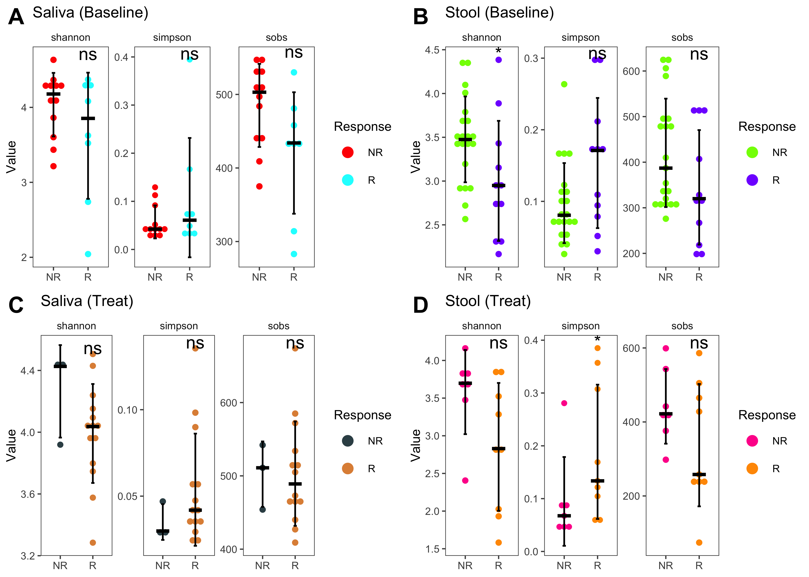
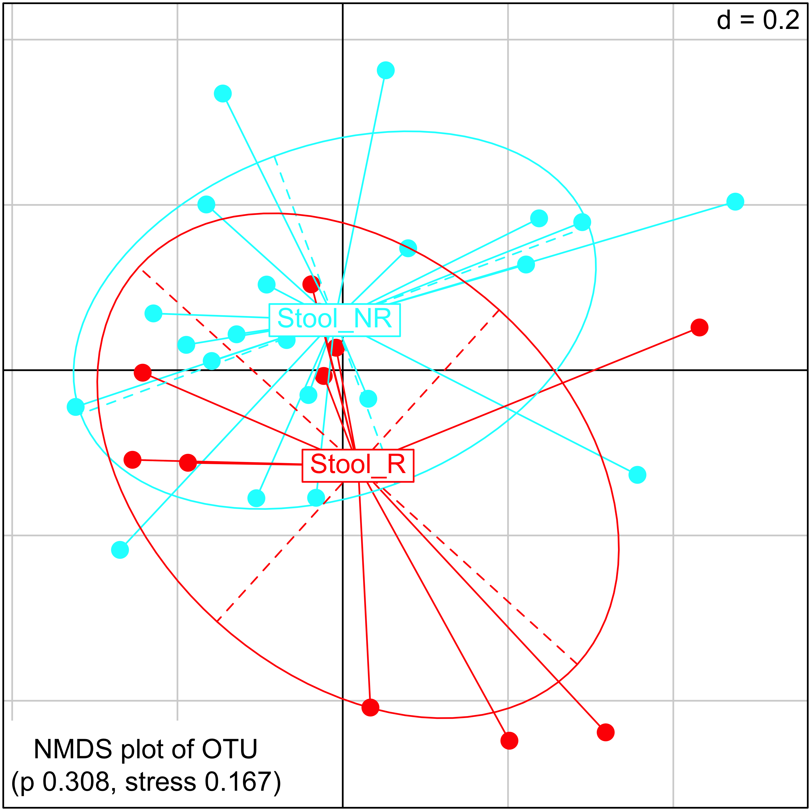
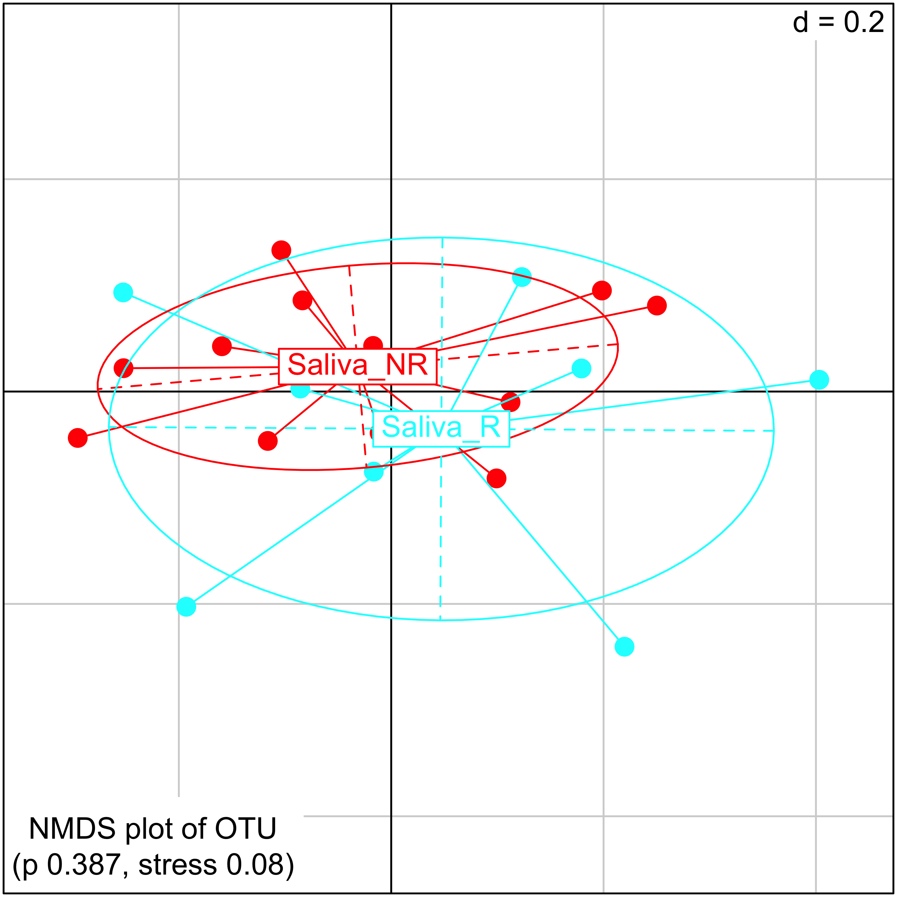

-   [1 Requires](#requires)
-   [2 Alpha and Beta Diversity
    Analysis](#alpha-and-beta-diversity-analysis)
    -   [2.1 Description](#description)
    -   [2.2 Alpha diversity](#alpha-diversity)
        -   [2.2.1 Code](#code)
        -   [2.2.2 Figures](#figures)
        -   [2.2.3 patients with both saliva and stool samples at
            baseline](#patients-with-both-saliva-and-stool-samples-at-baseline)
        -   [2.2.4 Paired baseline saliva and stool
            samples](#paired-baseline-saliva-and-stool-samples)
        -   [2.2.5 Figure](#figure)
    -   [2.3 beta diversity](#beta-diversity)
        -   [2.3.1 meta](#meta)
        -   [2.3.2 anosim: Analysis of
            Similarities](#anosim-analysis-of-similarities)
        -   [2.3.3 adonis: Permutational Multivariate Analysis of
            Variance](#adonis-permutational-multivariate-analysis-of-variance)

[`Return`](./)

1 Requires
==========

Requires

    library(data.table)
    library(tidyverse)
    library(ggthemes)
    library(ggsci)
    library(ggpubr)
    library(survminer)
    library(survival)
    library(survivalROC)
    library(reshape2)
    library(ggExtra)
    library(cowplot)
    library(GUniFrac)
    library(ade4)
    library(phangorn)
    library(fpc)
    library(vegan)
    source("../R_function/colors.R")
    "%ni%" <- Negate("%in%")
    theme_set(theme_few())
    options(stringsAsFactors = F)

2 Alpha and Beta Diversity Analysis
===================================

2.1 Description
---------------

**Ecosystem**

a community plus the physical environment that it occupies at a given
time

**Alpha diversity**

the diversity within a particular area or ecosystem; usually expressed
by the number of species (i.e., species richness) in that ecosystem

**Beta diversity**

a comparison of of diversity between ecosystems, usually measured as the
amount of species change between the ecosystems

**Gamma diversity**

a measure of the overall diversity within a large region.
Geographic-scale species diversity according to Hunter (2002: 448)

ref: Alpha, Beta, and Gamma Diversity. (2021, January 4). Retrieved
April 19, 2021, from
<a href="https://bio.libretexts.org/@go/page/17392" class="uri">https://bio.libretexts.org/@go/page/17392</a>

2.2 Alpha diversity
-------------------

### 2.2.1 Code

    meta<-fread("../Data/Data/meta.csv",data.table = F)
    alpha<-fread("../Data/Data/alpha_diversity.csv",data.table = F)[,c(1:4)]
    data<-merge(select(meta,c(Samples,Response,Cycle,Site)),alpha,by="Samples")
    data<-melt(data,id.vars = c("Samples","Response","Cycle","Site"),variable.name = "Index",value.name = "Value")
    data_BL<-subset(data,Cycle=="BL"&Response!="NE")
    data_treat<-subset(data,Cycle!="BL"&Response!="NE")

    data_BL$Group<-paste0(data_BL$Site,"_",data_BL$Response)
    data_BL$Index<-factor(data_BL$Index,levels = c("shannon","simpson","sobs"))

    data_treat$Group<-paste0(data_treat$Site,"_",data_treat$Response)
    data_treat$Index<-factor(data_treat$Index,levels = c("shannon","simpson","sobs"))

    p1<-ggplot(subset(data_BL,Site=="Saliva"),aes(Response,Value))+
      geom_dotplot(aes(fill=Response,color=Response),binaxis = "y",stackdir = "center",dotsize = .8)+
      stat_compare_means(ref.group = "NR",label = "p.signif")+
      stat_summary(fun.data = mean_sdl,fun.args = list(mult=1),geom = "errorbar",width=.1,size=0.5)+
      stat_summary(fun = median,geom = "crossbar",color="black",size=.4,width=.4)+
      facet_wrap(~Index,scales = "free")+ theme_few()+
      scale_color_manual(values = c("#FF0000FF","#00FFFFFF"))+
      scale_fill_manual(values = c("#FF0000FF","#00FFFFFF"))+
      ggtitle("Saliva (Baseline)")+
      theme_few(base_size = 8)+
      theme(axis.title.x = element_blank())
    p2<-ggplot(subset(data_BL,Site=="Stool"),aes(Response,Value))+
      geom_dotplot(aes(fill=Response,color=Response),binaxis = "y",stackdir = "center",dotsize = .8)+
      stat_compare_means(ref.group = "NR",label = "p.signif")+
      stat_summary(fun.data = mean_sdl,fun.args = list(mult=1),geom = "errorbar",width=.1,size=0.5)+
      stat_summary(fun = median,geom = "crossbar",color="black",size=.4,width=.4)+
      facet_wrap(~Index,scales = "free")+ theme_few()+
      scale_color_manual(values = c("#80FF00FF","#8000FFFF"))+
      scale_fill_manual(values = c("#80FF00FF","#8000FFFF"))+
      ggtitle("Stool (Baseline)")+
      theme_few(base_size = 8)+
      theme(axis.title.x = element_blank())
    p3<-ggplot(subset(data_treat,Site=="Saliva"),aes(Response,Value))+
      geom_dotplot(aes(fill=Response,color=Response),binaxis = "y",stackdir = "center",dotsize = .8)+
      stat_compare_means(ref.group = "NR",label = "p.signif")+
      stat_summary(fun.data = mean_sdl,fun.args = list(mult=1),geom = "errorbar",width=.1,size=0.5)+
      stat_summary(fun = median,geom = "crossbar",color="black",size=.4,width=.4)+
      facet_wrap(~Index,scales = "free")+ theme_few()+
      scale_color_jama()+
      scale_fill_jama()+
      ggtitle("Saliva (Treat)")+
      theme_few(base_size = 8)+
      theme(axis.title.x = element_blank())

    ##use the treated stool samples without duplication
    BL_treat<-fread("../Data/Data/16pt_BL_treat_pairs_stool.csv",data.table = F)
    BL_treat_alpha<-merge(select(BL_treat,c(Samples,Group,Response)),alpha,by="Samples")
    stool_treat<-subset(BL_treat_alpha,Group=="Treat")
    stool_treat1<-melt(stool_treat[,-2],id.vars = c("Samples","Response"),value.name = "Value",variable.name = "Index")
    stool_treat1$Index<-factor(stool_treat1$Index,levels = c("shannon","simpson","sobs"))
    p4<-ggplot(stool_treat1,aes(Response,Value))+
      geom_dotplot(aes(fill=Response,color=Response),binaxis = "y",stackdir = "center",dotsize = .8)+
      stat_summary(fun.data = mean_sdl,fun.args = list(mult=1),geom = "errorbar",width=.1,size=0.5)+
      stat_summary(fun = median,geom = "crossbar",color="black",size=.4,width=.4)+
      stat_compare_means(ref.group = "NR",label = "p.signif",method = "wilcox.test")+
      facet_wrap(~Index,scales = "free")+
      scale_color_manual(values = c("#FF0099FF","#FF9900FF"))+
      scale_fill_manual(values = c("#FF0099FF","#FF9900FF"))+
      ggtitle("Stool (Treat)")+
      theme_few(base_size = 8)+ 
      theme(axis.title.x = element_blank())

### 2.2.2 Figures

    plot_grid(p1,p2,p3,p4, labels = c("A","B","C","D"), ncol =2, nrow = 2)

    ## `stat_bindot()` using `bins = 30`. Pick better value with `binwidth`.
    ## `stat_bindot()` using `bins = 30`. Pick better value with `binwidth`.
    ## `stat_bindot()` using `bins = 30`. Pick better value with `binwidth`.
    ## `stat_bindot()` using `bins = 30`. Pick better value with `binwidth`.

### 2.2.3 patients with both saliva and stool samples at baseline

    paired_meta<-fread("../Data/Data/stool_saliva_BL_paried.csv",data.table = F)
    alpha_paired<-subset(alpha,Samples%in%paired_meta$Samples)
    alpha_paired<-merge(paired_meta,alpha_paired,by="Samples")%>%filter(.,Response!="NE")
    p5<-ggplot(alpha_paired,aes(Site,shannon,fill=Site))+
      geom_boxplot()+
      geom_line(aes(group=patientID))+
      geom_point(size=1)+
      theme_few(base_size = 8)+
      stat_compare_means(label = "p.signif")+
      facet_wrap(~Effect,scales = "free_x")+
      scale_fill_d3()

### 2.2.4 Paired baseline saliva and stool samples

#### 2.2.4.1 Code

    load("../Data/Data/regaMicrcobiome.RData")
    phylum_saliva<-regaMicrobiome$SalivaMicrobiome$TaxonomyComposition$Phylum
    phylum_stool<-regaMicrobiome$StoolMicrobiome$TaxonomyComposition$Phylum
    saliva_meta<-subset(paired_meta,Site=="Saliva"&Response!="NE")
    stool_meta<-subset(paired_meta,Site=="Stool"&Response!="NE")
    phylum_saliva<-phylum_saliva[,which(colnames(phylum_saliva)%in%saliva_meta$Samples)]
    phylum_stool<-phylum_stool[,which(colnames(phylum_stool)%in%stool_meta$Samples)]
    phylum_saliva<-data.frame(Samples=colnames(phylum_saliva),t(phylum_saliva))
    phylum_stool<-data.frame(Samples=colnames(phylum_stool),t(phylum_stool))
    phylum_saliva<-merge(select(paired_meta,c(patientID,Response,Samples)),phylum_saliva,by="Samples")
    phylum_stool<-merge(select(paired_meta,c(patientID,Response,Samples)),phylum_stool,by="Samples")
    phylum_saliva<-melt(phylum_saliva[,-1],id.vars = c("patientID","Response"),variable.name = "Phylum",value.name = "Abundance")
    phylum_stool<-melt(phylum_stool[,-1],id.vars = c("patientID","Response"),variable.name = "Phylum",value.name = "Abundance")
    phylum_saliva$Site=rep("Saliva",171)
    phylum_stool$Site=rep("Stool",171)
    df_p<-bind_rows(phylum_saliva,phylum_stool)
    test<-subset(df_p,Phylum=="Firmicutes"&Site=="Stool")
    g<-test[order(test$Abundance,decreasing = TRUE),]
    df_p$patientID<-factor(df_p$patientID,levels=g$patientID)
    levels(factor(df_p$Phylum))
    df_p$Phylum<-factor(df_p$Phylum,levels = c("Firmicutes","Bacteroidetes","Proteobacteria",
                                               "Fusobacteriota","Actinobacteriota","Campilobacterota",
                                               "Patescibacteria","Spirochaetota","Desulfobacterota",
                                               "Synergistota","Verrucomicrobiota","Others"))

    p1<-ggplot(subset(df_p,Site=="Saliva"),aes(patientID,Abundance,fill=Phylum))+
      geom_bar(stat = "identity", width=1)+
      facet_grid(~Response,scales = "free",space = "free")+
      scale_fill_manual(values = col11)+
      theme_few(base_size = 8)+
      theme(axis.text.x = element_blank(),
            strip.text = element_text(face = "bold"),
            axis.title.x = element_blank(),
            legend.margin = margin(0.1,unit="pt"),
            legend.key.size=unit(.1,"inches"),
            legend.text.align=0,
            legend.title=element_text(colour="black",size=8,face = "bold"),
            legend.direction = "horizontal",
            legend.box.just="top",
            legend.spacing = unit(0.1,"cm"),
            legend.spacing.y = unit(0.1,"cm"),
            legend.spacing.x =unit(0.1,"cm"),
            legend.box.spacing = unit(0.1,"cm"),
            legend.justification=c(.4,.4),
            legend.position="top")+
      ggtitle("Patients with paired baseline saliva and stool samples")

    p2<-ggplot(subset(df_p,Site=="Stool"),aes(patientID,Abundance,fill=Phylum))+
      geom_bar(stat = "identity", width=1)+
      facet_grid(~Response,scales = "free",space = "free")+
      scale_fill_manual(values = col11,guide=FALSE)+
      theme_few(base_size = 8)+
      theme(axis.text.x = element_text(angle = 90,vjust = 1,hjust = 1,size=6),
            strip.text = element_blank(),
            axis.title.x = element_blank())

    ##  [1] "Actinobacteriota"  "Bacteroidetes"     "Campilobacterota" 
    ##  [4] "Firmicutes"        "Fusobacteriota"    "Patescibacteria"  
    ##  [7] "Proteobacteria"    "Spirochaetota"     "Others"           
    ## [10] "Desulfobacterota"  "Synergistota"      "Verrucomicrobiota"

### 2.2.5 Figure

    plot_grid(p1,p2, labels = c("A","B"), ncol =1, nrow = 2)

2.3 beta diversity
------------------

### 2.3.1 meta

    meta_file<-subset(meta,Response!="NE"&Cycle=="BL")
    meta_file$Group<-paste0(meta_file$Site,"_",meta_file$Response)
    meta_file$newName<-paste0(meta_file$patientID,"_",meta_file$Cycle)

    meta_file_stool<-subset(meta_file,Site=="Stool")
    meta_file_saliva<-subset(meta_file,Site=="Saliva")
    meta_file_BL<-meta_file
    tree_file <- read.tree("../Data/Data/top500_OTU_phylo_tree.tre")
    rooted_tree <- midpoint(tree_file)
    otu<-fread("../Data/Data/top500_OTU_table_phylo_tree.csv",data.table = F)
    otu<-data.frame(row.names = otu$ID,otu[,-1])

    otu_stool<-otu[,which(colnames(otu)%in%meta_file_stool$Samples)]
    otu_saliva<-otu[,which(colnames(otu)%in%meta_file_saliva$Samples)]
    otu_BL<-otu[,which(colnames(otu)%in%meta_file_BL$Samples)]

    otu_stool<-data.frame(t(otu_stool[,order(names(otu_stool))]))
    otu_saliva<-data.frame(t(otu_saliva[,order(names(otu_saliva))]))
    otu_BL<-data.frame(t(otu_BL[,order(names(otu_BL))]))

    unifracs_stool<-GUniFrac(otu_stool, rooted_tree, alpha = c(0.0,0.5,1.0))$unifracs
    unifracs_saliva<-GUniFrac(otu_saliva, rooted_tree, alpha = c(0.0,0.5,1.0))$unifracs
    unifracs_BL<-GUniFrac(otu_BL, rooted_tree, alpha = c(0.0,0.5,1.0))$unifracs

    unifract_dist_stool <- unifracs_stool[, , "d_0.5"]# GUniFrac with alpha 0.5
    unifract_dist_saliva <- unifracs_saliva[, , "d_0.5"]
    unifract_dist_BL <- unifracs_BL[, , "d_0.5"]

    stool_fit<-hclust(as.dist(unifract_dist_stool),method = "ward.D2")
    saliva_fit<-hclust(as.dist(unifract_dist_saliva),method = "ward.D2")
    BL_fit<-hclust(as.dist(unifract_dist_BL),method = "ward.D2")

    stool_tree <- as.phylo(stool_fit)
    saliva_tree <- as.phylo(saliva_fit)
    BL_tree <- as.phylo(BL_fit)

    stool_groups<-as.factor(c(meta_file_stool$Group))
    saliva_groups<-as.factor(c(meta_file_saliva$Group))
    BL_groups<-as.factor(c(meta_file_BL$Group))

    plot_color_BL<-rainbow(length(levels(BL_groups)))[BL_groups]
    plot_color_stool<-rainbow(length(levels(stool_groups)))[stool_groups]
    plot_color_saliva<-rainbow(length(levels(saliva_groups)))[saliva_groups]

### 2.3.2 anosim: Analysis of Similarities

**Description** Analysis of similarities (ANOSIM) provides a way to test
statistically whether there is a significant difference between two or
more groups of sampling units.

    par(mfrow=c(1,3))
    plot(anosim(vegdist(otu_stool,method = "bray"), meta_file_stool$Group),xlab="",ylab="",col=c("gray","#8000FFFF","#80FF00FF"))
    plot(anosim(vegdist(otu_saliva,method = "bray"), meta_file_saliva$Group),xlab="",ylab="",col=c("gray","#00FFFFFF","#FF0000FF"))
    plot(anosim(vegdist(otu_BL,method = "bray"), meta_file_BL$Group),xlab="",ylab="",col=c("gray","#00FFFFFF","#FF0000FF","#8000FFFF","#80FF00FF"))

### 2.3.3 adonis: Permutational Multivariate Analysis of Variance

\*\* Description\*\* Analysis of variance using distance matrices — for
partitioning distance matrices among sources of variation and fitting
linear models (e.g., factors, polynomial regression) to distance
matrices; uses a permutation test with pseudo-F ratios.

    adonis_stool<-adonis2(as.dist(unifract_dist_stool) ~ stool_groups)
    adonis_saliva<-adonis2(as.dist(unifract_dist_saliva) ~ saliva_groups)
    adonis_BL<-adonis2(as.dist(unifract_dist_BL) ~ BL_groups)

    # Calculate and display the NMDS plot (Non-metric Multidimensional Scaling plot)
    res_stool <- metaMDS(unifract_dist_stool,k = 2,distance = "bray")
    s.class(
      res_stool$points, col = unique(plot_color_stool), cpoint = 2, 
      fac = stool_groups,
      sub = paste("NMDS plot of OTU \n (p ",adonis_stool$`Pr(>F)`[1],", stress ",
                  round(res_stool$stress,3),")",sep="")
    )

    res_saliva <- metaMDS(unifract_dist_saliva,k = 2,distance = "bray")
    s.class(
      res_saliva$points, col = unique(plot_color_saliva), cpoint = 2, 
      fac = saliva_groups,
      sub = paste("NMDS plot of OTU \n (p ",adonis_saliva$`Pr(>F)`[1],", stress ",round(res_saliva$stress,3),")",sep="")
    )

    res_BL <- metaMDS(unifract_dist_BL,k = 2,distance = "bray")
    s.class(
      res_BL$points, col = unique(plot_color_BL), cpoint = 2, 
      fac = BL_groups,
      sub = paste("NMDS plot of OTU \n (p ",adonis_BL$`Pr(>F)`[1],", stress ",
                  round(res_BL$stress,3),")",sep="")
    )

    ## Run 0 stress 0.1685622 
    ## Run 1 stress 0.168407 
    ## ... New best solution
    ## ... Procrustes: rmse 0.01290151  max resid 0.05543061 
    ## Run 2 stress 0.1685622 
    ## ... Procrustes: rmse 0.01290431  max resid 0.05539302 
    ## Run 3 stress 0.168407 
    ## ... New best solution
    ## ... Procrustes: rmse 1.288954e-05  max resid 3.889078e-05 
    ## ... Similar to previous best
    ## Run 4 stress 0.2124112 
    ## Run 5 stress 0.2023698 
    ## Run 6 stress 0.1731867 
    ## Run 7 stress 0.1685622 
    ## ... Procrustes: rmse 0.012908  max resid 0.05542092 
    ## Run 8 stress 0.1740149 
    ## Run 9 stress 0.2176128 
    ## Run 10 stress 0.2275268 
    ## Run 11 stress 0.1668062 
    ## ... New best solution
    ## ... Procrustes: rmse 0.06416315  max resid 0.3365418 
    ## Run 12 stress 0.213827 
    ## Run 13 stress 0.1685622 
    ## Run 14 stress 0.1731686 
    ## Run 15 stress 0.1685622 
    ## Run 16 stress 0.1689634 
    ## Run 17 stress 0.1912442 
    ## Run 18 stress 0.1694642 
    ## Run 19 stress 0.168407 
    ## Run 20 stress 0.168407 
    ## *** No convergence -- monoMDS stopping criteria:
    ##      1: no. of iterations >= maxit
    ##     17: stress ratio > sratmax
    ##      2: scale factor of the gradient < sfgrmin
    ## Run 0 stress 0.07988775 
    ## Run 1 stress 0.0989745 
    ## Run 2 stress 0.07988776 
    ## ... Procrustes: rmse 2.386883e-05  max resid 8.552938e-05 
    ## ... Similar to previous best
    ## Run 3 stress 0.09897454 
    ## Run 4 stress 0.07988775 
    ## ... Procrustes: rmse 5.570222e-06  max resid 2.052879e-05 
    ## ... Similar to previous best
    ## Run 5 stress 0.09333011 
    ## Run 6 stress 0.08928076 
    ## Run 7 stress 0.1142582 
    ## Run 8 stress 0.08928076 
    ## Run 9 stress 0.09333011 
    ## Run 10 stress 0.09333012 
    ## Run 11 stress 0.07988776 
    ## ... Procrustes: rmse 2.513094e-05  max resid 8.887206e-05 
    ## ... Similar to previous best
    ## Run 12 stress 0.09333011 
    ## Run 13 stress 0.08928077 
    ## Run 14 stress 0.1125236 
    ## Run 15 stress 0.07988776 
    ## ... Procrustes: rmse 2.914718e-05  max resid 0.0001044393 
    ## ... Similar to previous best
    ## Run 16 stress 0.07988776 
    ## ... Procrustes: rmse 7.807039e-06  max resid 2.261067e-05 
    ## ... Similar to previous best
    ## Run 17 stress 0.09897446 
    ## Run 18 stress 0.07988775 
    ## ... New best solution
    ## ... Procrustes: rmse 1.045107e-06  max resid 2.081361e-06 
    ## ... Similar to previous best
    ## Run 19 stress 0.1147202 
    ## Run 20 stress 0.1155594 
    ## *** Solution reached
    ## Run 0 stress 0.1175033 
    ## Run 1 stress 0.1175033 
    ## ... Procrustes: rmse 8.282464e-06  max resid 4.493787e-05 
    ## ... Similar to previous best
    ## Run 2 stress 0.1330585 
    ## Run 3 stress 0.1617583 
    ## Run 4 stress 0.1386751 
    ## Run 5 stress 0.1175033 
    ## ... Procrustes: rmse 1.141995e-06  max resid 6.365644e-06 
    ## ... Similar to previous best
    ## Run 6 stress 0.1438214 
    ## Run 7 stress 0.1411128 
    ## Run 8 stress 0.1535976 
    ## Run 9 stress 0.1175033 
    ## ... Procrustes: rmse 5.462271e-06  max resid 3.07049e-05 
    ## ... Similar to previous best
    ## Run 10 stress 0.1626249 
    ## Run 11 stress 0.1175033 
    ## ... Procrustes: rmse 3.819085e-06  max resid 2.466558e-05 
    ## ... Similar to previous best
    ## Run 12 stress 0.1386743 
    ## Run 13 stress 0.1430345 
    ## Run 14 stress 0.1463152 
    ## Run 15 stress 0.1233122 
    ## Run 16 stress 0.1175033 
    ## ... Procrustes: rmse 2.476553e-06  max resid 1.552655e-05 
    ## ... Similar to previous best
    ## Run 17 stress 0.1580135 
    ## Run 18 stress 0.1430345 
    ## Run 19 stress 0.1412382 
    ## Run 20 stress 0.1330585 
    ## *** Solution reached
