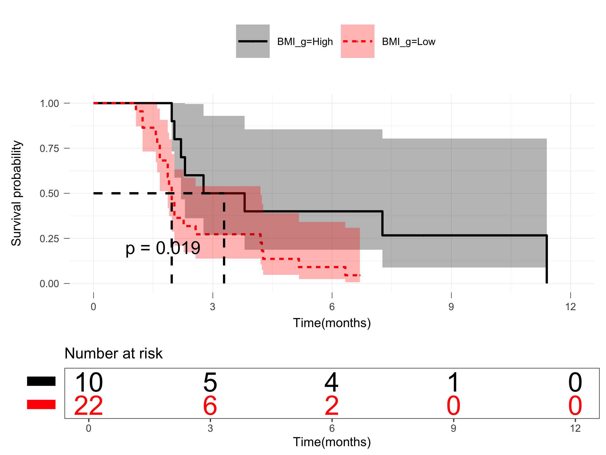

-   [1 Introduction](#introduction)
-   [2 Environment](#environment)
-   [3 Clinical](#clinical)
-   [4 Samples sequending statistics](#samples-sequending-statistics)
-   [5 Vsisualization](#vsisualization)

=======================================================================
[`Return`](./)

1 Introduction
==============

<table>
<tr>
<td bgcolor="#AFEEEE">
`This is introduction`
</td>
</tr>
</table>

2 Environment
=============

**Requires and Environment**

    library(tidyverse)

    ## ─ Attaching packages ──────────────────── tidyverse 1.3.0 ─

    ## ✓ ggplot2 3.3.3     ✓ purrr   0.3.4
    ## ✓ tibble  3.1.0     ✓ dplyr   1.0.5
    ## ✓ tidyr   1.1.3     ✓ stringr 1.4.0
    ## ✓ readr   1.4.0     ✓ forcats 0.5.1

    ## ─ Conflicts ───────────────────── tidyverse_conflicts() ─
    ## x dplyr::filter() masks stats::filter()
    ## x dplyr::lag()    masks stats::lag()

    library(ggthemes)
    library(ggsci)
    library(ggpubr)
    library(survminer)
    library(survival)
    library(survivalROC)
    library(reshape2)

    ## 
    ## Attaching package: 'reshape2'

    ## The following object is masked from 'package:tidyr':
    ## 
    ##     smiths

    library(data.table)

    ## 
    ## Attaching package: 'data.table'

    ## The following objects are masked from 'package:reshape2':
    ## 
    ##     dcast, melt

    ## The following objects are masked from 'package:dplyr':
    ## 
    ##     between, first, last

    ## The following object is masked from 'package:purrr':
    ## 
    ##     transpose

    library(ggExtra)
    library(cowplot)

    ## 
    ## Attaching package: 'cowplot'

    ## The following object is masked from 'package:ggpubr':
    ## 
    ##     get_legend

    ## The following object is masked from 'package:ggthemes':
    ## 
    ##     theme_map

    library(ComplexHeatmap)

    ## Loading required package: grid

    ## ========================================
    ## ComplexHeatmap version 2.2.0
    ## Bioconductor page: http://bioconductor.org/packages/ComplexHeatmap/
    ## Github page: https://github.com/jokergoo/ComplexHeatmap
    ## Documentation: http://jokergoo.github.io/ComplexHeatmap-reference
    ## 
    ## If you use it in published research, please cite:
    ## Gu, Z. Complex heatmaps reveal patterns and correlations in multidimensional 
    ##   genomic data. Bioinformatics 2016.
    ## ========================================

    library(scico)
    library(colorspace)
    library(RColorBrewer)
    library(lubridate)

    ## 
    ## Attaching package: 'lubridate'

    ## The following object is masked from 'package:cowplot':
    ## 
    ##     stamp

    ## The following objects are masked from 'package:data.table':
    ## 
    ##     hour, isoweek, mday, minute, month, quarter, second, wday, week,
    ##     yday, year

    ## The following objects are masked from 'package:base':
    ## 
    ##     date, intersect, setdiff, union

    source("../R_function/colors.R")
    source("../R_function/surv_plot.R")
    theme_set(theme_cowplot())
    "%ni%" <- Negate("%in%")
    options(stringsAsFactors = F)
    sessionInfo()

    ## R version 3.6.2 (2019-12-12)
    ## Platform: x86_64-apple-darwin15.6.0 (64-bit)
    ## Running under: macOS Catalina 10.15.4
    ## 
    ## Matrix products: default
    ## BLAS:   /Library/Frameworks/R.framework/Versions/3.6/Resources/lib/libRblas.0.dylib
    ## LAPACK: /Library/Frameworks/R.framework/Versions/3.6/Resources/lib/libRlapack.dylib
    ## 
    ## locale:
    ## [1] zh_CN.UTF-8/zh_CN.UTF-8/zh_CN.UTF-8/C/zh_CN.UTF-8/zh_CN.UTF-8
    ## 
    ## attached base packages:
    ## [1] grid      stats     graphics  grDevices utils     datasets  methods  
    ## [8] base     
    ## 
    ## other attached packages:
    ##  [1] lubridate_1.7.10     RColorBrewer_1.1-2   colorspace_2.0-0    
    ##  [4] scico_1.2.0          ComplexHeatmap_2.2.0 cowplot_1.1.1       
    ##  [7] ggExtra_0.9          data.table_1.13.6    reshape2_1.4.4      
    ## [10] survivalROC_1.0.3    survival_3.2-7       survminer_0.4.9     
    ## [13] ggpubr_0.4.0         ggsci_2.9            ggthemes_4.2.4      
    ## [16] forcats_0.5.1        stringr_1.4.0        dplyr_1.0.5         
    ## [19] purrr_0.3.4          readr_1.4.0          tidyr_1.1.3         
    ## [22] tibble_3.1.0         ggplot2_3.3.3        tidyverse_1.3.0     
    ## 
    ## loaded via a namespace (and not attached):
    ##  [1] fs_1.5.0            httr_1.4.2          tools_3.6.2        
    ##  [4] backports_1.2.1     utf8_1.1.4          R6_2.5.0           
    ##  [7] DBI_1.1.1           GetoptLong_1.0.5    withr_2.4.1        
    ## [10] tidyselect_1.1.0    gridExtra_2.3       curl_4.3           
    ## [13] compiler_3.6.2      cli_2.3.1           rvest_1.0.0        
    ## [16] formatR_1.7         xml2_1.3.2          scales_1.1.1       
    ## [19] survMisc_0.5.5      digest_0.6.27       foreign_0.8-76     
    ## [22] rmarkdown_2.7       rio_0.5.26          pkgconfig_2.0.3    
    ## [25] htmltools_0.5.1.1   fastmap_1.1.0       dbplyr_2.1.0       
    ## [28] GlobalOptions_0.1.2 rlang_0.4.10        readxl_1.3.1       
    ## [31] rstudioapi_0.13     shiny_1.6.0         shape_1.4.5        
    ## [34] generics_0.1.0      zoo_1.8-9           jsonlite_1.7.2     
    ## [37] zip_2.1.1           car_3.0-10          magrittr_2.0.1     
    ## [40] Matrix_1.3-2        Rcpp_1.0.6          munsell_0.5.0      
    ## [43] fansi_0.4.2         abind_1.4-5         lifecycle_1.0.0    
    ## [46] stringi_1.5.3       yaml_2.2.1          carData_3.0-4      
    ## [49] plyr_1.8.6          parallel_3.6.2      promises_1.2.0.1   
    ## [52] crayon_1.4.1        miniUI_0.1.1.1      lattice_0.20-41    
    ## [55] haven_2.3.1         splines_3.6.2       circlize_0.4.12    
    ## [58] hms_1.0.0           knitr_1.31          pillar_1.5.1       
    ## [61] rjson_0.2.20        ggsignif_0.6.1      reprex_1.0.0       
    ## [64] glue_1.4.2          evaluate_0.14       modelr_0.1.8       
    ## [67] png_0.1-7           httpuv_1.5.5        vctrs_0.3.6        
    ## [70] cellranger_1.1.0    gtable_0.3.0        clue_0.3-58        
    ## [73] km.ci_0.5-2         assertthat_0.2.1    xfun_0.21          
    ## [76] openxlsx_4.2.3      mime_0.10           xtable_1.8-4       
    ## [79] broom_0.7.5         later_1.1.0.1       rstatix_0.7.0      
    ## [82] KMsurv_0.1-5        cluster_2.1.1       ellipsis_0.3.1

3 Clinical
==========

<a href="../Data/Data/clinical.csv" target="csv">Clinical.csv</a>

    cli<-fread("../Data/Data/clinical.csv",data.table = F)
    knitr::kable(cli,digits = 1)

<table style="width:100%;">
<colgroup>
<col style="width: 4%" />
<col style="width: 4%" />
<col style="width: 3%" />
<col style="width: 8%" />
<col style="width: 2%" />
<col style="width: 2%" />
<col style="width: 4%" />
<col style="width: 3%" />
<col style="width: 1%" />
<col style="width: 2%" />
<col style="width: 3%" />
<col style="width: 3%" />
<col style="width: 4%" />
<col style="width: 4%" />
<col style="width: 4%" />
<col style="width: 3%" />
<col style="width: 2%" />
<col style="width: 3%" />
<col style="width: 5%" />
<col style="width: 3%" />
<col style="width: 6%" />
<col style="width: 7%" />
<col style="width: 4%" />
<col style="width: 1%" />
<col style="width: 1%" />
<col style="width: 3%" />
<col style="width: 3%" />
</colgroup>
<thead>
<tr class="header">
<th style="text-align: left;">patientID</th>
<th style="text-align: left;">Response</th>
<th style="text-align: left;">Effect</th>
<th style="text-align: right;">Hand_food_syndrom</th>
<th style="text-align: right;">Rash</th>
<th style="text-align: right;">Fever</th>
<th style="text-align: right;">Diarrhea</th>
<th style="text-align: right;">Gender</th>
<th style="text-align: right;">Age</th>
<th style="text-align: right;">BMI</th>
<th style="text-align: right;">History</th>
<th style="text-align: right;">Smoking</th>
<th style="text-align: right;">Dringking</th>
<th style="text-align: right;">anitEGFR</th>
<th style="text-align: right;">antiVEGF</th>
<th style="text-align: right;">LiverM</th>
<th style="text-align: right;">LungM</th>
<th style="text-align: right;">LymphM</th>
<th style="text-align: right;">PeritonealM</th>
<th style="text-align: right;">OtherM</th>
<th style="text-align: right;">MetastasisNum</th>
<th style="text-align: right;">PathologicalType</th>
<th style="text-align: right;">Location</th>
<th style="text-align: right;">PFS</th>
<th style="text-align: right;">OS</th>
<th style="text-align: right;">PFStime</th>
<th style="text-align: right;">OStime</th>
</tr>
</thead>
<tbody>
<tr class="odd">
<td style="text-align: left;">Patient02</td>
<td style="text-align: left;">NR</td>
<td style="text-align: left;">PD</td>
<td style="text-align: right;">2</td>
<td style="text-align: right;">1</td>
<td style="text-align: right;">0</td>
<td style="text-align: right;">0</td>
<td style="text-align: right;">2</td>
<td style="text-align: right;">69</td>
<td style="text-align: right;">20.4</td>
<td style="text-align: right;">0</td>
<td style="text-align: right;">0</td>
<td style="text-align: right;">0</td>
<td style="text-align: right;">0</td>
<td style="text-align: right;">0</td>
<td style="text-align: right;">1</td>
<td style="text-align: right;">1</td>
<td style="text-align: right;">1</td>
<td style="text-align: right;">0</td>
<td style="text-align: right;">0</td>
<td style="text-align: right;">3</td>
<td style="text-align: right;">2</td>
<td style="text-align: right;">1</td>
<td style="text-align: right;">1</td>
<td style="text-align: right;">1</td>
<td style="text-align: right;">1.6</td>
<td style="text-align: right;">15.5</td>
</tr>
<tr class="even">
<td style="text-align: left;">Patient03</td>
<td style="text-align: left;">R</td>
<td style="text-align: left;">PR</td>
<td style="text-align: right;">2</td>
<td style="text-align: right;">1</td>
<td style="text-align: right;">0</td>
<td style="text-align: right;">0</td>
<td style="text-align: right;">2</td>
<td style="text-align: right;">51</td>
<td style="text-align: right;">26.0</td>
<td style="text-align: right;">1</td>
<td style="text-align: right;">0</td>
<td style="text-align: right;">0</td>
<td style="text-align: right;">0</td>
<td style="text-align: right;">1</td>
<td style="text-align: right;">0</td>
<td style="text-align: right;">1</td>
<td style="text-align: right;">0</td>
<td style="text-align: right;">0</td>
<td style="text-align: right;">0</td>
<td style="text-align: right;">1</td>
<td style="text-align: right;">2</td>
<td style="text-align: right;">2</td>
<td style="text-align: right;">1</td>
<td style="text-align: right;">0</td>
<td style="text-align: right;">11.4</td>
<td style="text-align: right;">15.8</td>
</tr>
<tr class="odd">
<td style="text-align: left;">Patient04</td>
<td style="text-align: left;">NR</td>
<td style="text-align: left;">PD</td>
<td style="text-align: right;">3</td>
<td style="text-align: right;">2</td>
<td style="text-align: right;">0</td>
<td style="text-align: right;">0</td>
<td style="text-align: right;">2</td>
<td style="text-align: right;">55</td>
<td style="text-align: right;">28.3</td>
<td style="text-align: right;">0</td>
<td style="text-align: right;">0</td>
<td style="text-align: right;">0</td>
<td style="text-align: right;">1</td>
<td style="text-align: right;">1</td>
<td style="text-align: right;">1</td>
<td style="text-align: right;">1</td>
<td style="text-align: right;">0</td>
<td style="text-align: right;">0</td>
<td style="text-align: right;">0</td>
<td style="text-align: right;">2</td>
<td style="text-align: right;">2</td>
<td style="text-align: right;">2</td>
<td style="text-align: right;">1</td>
<td style="text-align: right;">1</td>
<td style="text-align: right;">2.2</td>
<td style="text-align: right;">7.1</td>
</tr>
<tr class="even">
<td style="text-align: left;">Patient05</td>
<td style="text-align: left;">NR</td>
<td style="text-align: left;">PD</td>
<td style="text-align: right;">2</td>
<td style="text-align: right;">0</td>
<td style="text-align: right;">0</td>
<td style="text-align: right;">0</td>
<td style="text-align: right;">1</td>
<td style="text-align: right;">44</td>
<td style="text-align: right;">21.5</td>
<td style="text-align: right;">1</td>
<td style="text-align: right;">0</td>
<td style="text-align: right;">0</td>
<td style="text-align: right;">0</td>
<td style="text-align: right;">0</td>
<td style="text-align: right;">1</td>
<td style="text-align: right;">0</td>
<td style="text-align: right;">1</td>
<td style="text-align: right;">0</td>
<td style="text-align: right;">0</td>
<td style="text-align: right;">2</td>
<td style="text-align: right;">1</td>
<td style="text-align: right;">1</td>
<td style="text-align: right;">1</td>
<td style="text-align: right;">1</td>
<td style="text-align: right;">2.0</td>
<td style="text-align: right;">6.3</td>
</tr>
<tr class="odd">
<td style="text-align: left;">Patient06</td>
<td style="text-align: left;">R</td>
<td style="text-align: left;">SD</td>
<td style="text-align: right;">3</td>
<td style="text-align: right;">0</td>
<td style="text-align: right;">0</td>
<td style="text-align: right;">0</td>
<td style="text-align: right;">1</td>
<td style="text-align: right;">37</td>
<td style="text-align: right;">25.9</td>
<td style="text-align: right;">0</td>
<td style="text-align: right;">0</td>
<td style="text-align: right;">0</td>
<td style="text-align: right;">1</td>
<td style="text-align: right;">0</td>
<td style="text-align: right;">1</td>
<td style="text-align: right;">0</td>
<td style="text-align: right;">0</td>
<td style="text-align: right;">0</td>
<td style="text-align: right;">0</td>
<td style="text-align: right;">1</td>
<td style="text-align: right;">2</td>
<td style="text-align: right;">2</td>
<td style="text-align: right;">1</td>
<td style="text-align: right;">0</td>
<td style="text-align: right;">3.8</td>
<td style="text-align: right;">12.4</td>
</tr>
<tr class="even">
<td style="text-align: left;">Patient08</td>
<td style="text-align: left;">NR</td>
<td style="text-align: left;">PD</td>
<td style="text-align: right;">0</td>
<td style="text-align: right;">0</td>
<td style="text-align: right;">0</td>
<td style="text-align: right;">3</td>
<td style="text-align: right;">1</td>
<td style="text-align: right;">64</td>
<td style="text-align: right;">24.7</td>
<td style="text-align: right;">0</td>
<td style="text-align: right;">0</td>
<td style="text-align: right;">0</td>
<td style="text-align: right;">1</td>
<td style="text-align: right;">0</td>
<td style="text-align: right;">1</td>
<td style="text-align: right;">0</td>
<td style="text-align: right;">0</td>
<td style="text-align: right;">1</td>
<td style="text-align: right;">0</td>
<td style="text-align: right;">2</td>
<td style="text-align: right;">2</td>
<td style="text-align: right;">2</td>
<td style="text-align: right;">1</td>
<td style="text-align: right;">1</td>
<td style="text-align: right;">2.0</td>
<td style="text-align: right;">3.9</td>
</tr>
<tr class="odd">
<td style="text-align: left;">Patient09</td>
<td style="text-align: left;">R</td>
<td style="text-align: left;">PR</td>
<td style="text-align: right;">2</td>
<td style="text-align: right;">1</td>
<td style="text-align: right;">2</td>
<td style="text-align: right;">0</td>
<td style="text-align: right;">1</td>
<td style="text-align: right;">37</td>
<td style="text-align: right;">20.7</td>
<td style="text-align: right;">1</td>
<td style="text-align: right;">0</td>
<td style="text-align: right;">0</td>
<td style="text-align: right;">0</td>
<td style="text-align: right;">1</td>
<td style="text-align: right;">0</td>
<td style="text-align: right;">1</td>
<td style="text-align: right;">0</td>
<td style="text-align: right;">0</td>
<td style="text-align: right;">0</td>
<td style="text-align: right;">1</td>
<td style="text-align: right;">2</td>
<td style="text-align: right;">1</td>
<td style="text-align: right;">1</td>
<td style="text-align: right;">0</td>
<td style="text-align: right;">7.7</td>
<td style="text-align: right;">10.6</td>
</tr>
<tr class="even">
<td style="text-align: left;">Patient10</td>
<td style="text-align: left;">R</td>
<td style="text-align: left;">SD</td>
<td style="text-align: right;">1</td>
<td style="text-align: right;">2</td>
<td style="text-align: right;">2</td>
<td style="text-align: right;">0</td>
<td style="text-align: right;">2</td>
<td style="text-align: right;">44</td>
<td style="text-align: right;">19.3</td>
<td style="text-align: right;">0</td>
<td style="text-align: right;">0</td>
<td style="text-align: right;">0</td>
<td style="text-align: right;">0</td>
<td style="text-align: right;">1</td>
<td style="text-align: right;">1</td>
<td style="text-align: right;">1</td>
<td style="text-align: right;">0</td>
<td style="text-align: right;">1</td>
<td style="text-align: right;">1</td>
<td style="text-align: right;">4</td>
<td style="text-align: right;">2</td>
<td style="text-align: right;">1</td>
<td style="text-align: right;">1</td>
<td style="text-align: right;">0</td>
<td style="text-align: right;">4.2</td>
<td style="text-align: right;">10.1</td>
</tr>
<tr class="odd">
<td style="text-align: left;">Patient11</td>
<td style="text-align: left;">R</td>
<td style="text-align: left;">SD</td>
<td style="text-align: right;">2</td>
<td style="text-align: right;">0</td>
<td style="text-align: right;">0</td>
<td style="text-align: right;">0</td>
<td style="text-align: right;">2</td>
<td style="text-align: right;">57</td>
<td style="text-align: right;">25.1</td>
<td style="text-align: right;">1</td>
<td style="text-align: right;">0</td>
<td style="text-align: right;">0</td>
<td style="text-align: right;">0</td>
<td style="text-align: right;">1</td>
<td style="text-align: right;">1</td>
<td style="text-align: right;">1</td>
<td style="text-align: right;">0</td>
<td style="text-align: right;">0</td>
<td style="text-align: right;">0</td>
<td style="text-align: right;">2</td>
<td style="text-align: right;">1</td>
<td style="text-align: right;">2</td>
<td style="text-align: right;">1</td>
<td style="text-align: right;">0</td>
<td style="text-align: right;">7.3</td>
<td style="text-align: right;">10.4</td>
</tr>
<tr class="even">
<td style="text-align: left;">Patient12</td>
<td style="text-align: left;">NE</td>
<td style="text-align: left;">NE</td>
<td style="text-align: right;">3</td>
<td style="text-align: right;">0</td>
<td style="text-align: right;">0</td>
<td style="text-align: right;">0</td>
<td style="text-align: right;">2</td>
<td style="text-align: right;">39</td>
<td style="text-align: right;">21.4</td>
<td style="text-align: right;">0</td>
<td style="text-align: right;">0</td>
<td style="text-align: right;">0</td>
<td style="text-align: right;">0</td>
<td style="text-align: right;">0</td>
<td style="text-align: right;">1</td>
<td style="text-align: right;">1</td>
<td style="text-align: right;">1</td>
<td style="text-align: right;">0</td>
<td style="text-align: right;">0</td>
<td style="text-align: right;">3</td>
<td style="text-align: right;">0</td>
<td style="text-align: right;">2</td>
<td style="text-align: right;">1</td>
<td style="text-align: right;">0</td>
<td style="text-align: right;">3.7</td>
<td style="text-align: right;">10.3</td>
</tr>
<tr class="odd">
<td style="text-align: left;">Patient13</td>
<td style="text-align: left;">R</td>
<td style="text-align: left;">PR</td>
<td style="text-align: right;">3</td>
<td style="text-align: right;">0</td>
<td style="text-align: right;">1</td>
<td style="text-align: right;">0</td>
<td style="text-align: right;">1</td>
<td style="text-align: right;">46</td>
<td style="text-align: right;">21.4</td>
<td style="text-align: right;">0</td>
<td style="text-align: right;">0</td>
<td style="text-align: right;">0</td>
<td style="text-align: right;">1</td>
<td style="text-align: right;">1</td>
<td style="text-align: right;">1</td>
<td style="text-align: right;">0</td>
<td style="text-align: right;">1</td>
<td style="text-align: right;">1</td>
<td style="text-align: right;">0</td>
<td style="text-align: right;">3</td>
<td style="text-align: right;">1</td>
<td style="text-align: right;">1</td>
<td style="text-align: right;">1</td>
<td style="text-align: right;">1</td>
<td style="text-align: right;">6.3</td>
<td style="text-align: right;">10.3</td>
</tr>
<tr class="even">
<td style="text-align: left;">Patient14</td>
<td style="text-align: left;">NR</td>
<td style="text-align: left;">PD</td>
<td style="text-align: right;">0</td>
<td style="text-align: right;">3</td>
<td style="text-align: right;">0</td>
<td style="text-align: right;">0</td>
<td style="text-align: right;">2</td>
<td style="text-align: right;">57</td>
<td style="text-align: right;">21.4</td>
<td style="text-align: right;">1</td>
<td style="text-align: right;">0</td>
<td style="text-align: right;">1</td>
<td style="text-align: right;">0</td>
<td style="text-align: right;">1</td>
<td style="text-align: right;">1</td>
<td style="text-align: right;">0</td>
<td style="text-align: right;">0</td>
<td style="text-align: right;">0</td>
<td style="text-align: right;">0</td>
<td style="text-align: right;">1</td>
<td style="text-align: right;">2</td>
<td style="text-align: right;">1</td>
<td style="text-align: right;">1</td>
<td style="text-align: right;">0</td>
<td style="text-align: right;">1.2</td>
<td style="text-align: right;">2.7</td>
</tr>
<tr class="odd">
<td style="text-align: left;">Patient16</td>
<td style="text-align: left;">R</td>
<td style="text-align: left;">PR</td>
<td style="text-align: right;">3</td>
<td style="text-align: right;">0</td>
<td style="text-align: right;">0</td>
<td style="text-align: right;">0</td>
<td style="text-align: right;">2</td>
<td style="text-align: right;">66</td>
<td style="text-align: right;">25.3</td>
<td style="text-align: right;">0</td>
<td style="text-align: right;">0</td>
<td style="text-align: right;">0</td>
<td style="text-align: right;">1</td>
<td style="text-align: right;">1</td>
<td style="text-align: right;">0</td>
<td style="text-align: right;">1</td>
<td style="text-align: right;">0</td>
<td style="text-align: right;">0</td>
<td style="text-align: right;">0</td>
<td style="text-align: right;">1</td>
<td style="text-align: right;">2</td>
<td style="text-align: right;">2</td>
<td style="text-align: right;">0</td>
<td style="text-align: right;">0</td>
<td style="text-align: right;">8.3</td>
<td style="text-align: right;">9.6</td>
</tr>
<tr class="even">
<td style="text-align: left;">Patient17</td>
<td style="text-align: left;">NR</td>
<td style="text-align: left;">PD</td>
<td style="text-align: right;">2</td>
<td style="text-align: right;">0</td>
<td style="text-align: right;">0</td>
<td style="text-align: right;">0</td>
<td style="text-align: right;">2</td>
<td style="text-align: right;">61</td>
<td style="text-align: right;">23.9</td>
<td style="text-align: right;">1</td>
<td style="text-align: right;">0</td>
<td style="text-align: right;">0</td>
<td style="text-align: right;">0</td>
<td style="text-align: right;">1</td>
<td style="text-align: right;">1</td>
<td style="text-align: right;">1</td>
<td style="text-align: right;">0</td>
<td style="text-align: right;">1</td>
<td style="text-align: right;">0</td>
<td style="text-align: right;">3</td>
<td style="text-align: right;">1</td>
<td style="text-align: right;">1</td>
<td style="text-align: right;">1</td>
<td style="text-align: right;">1</td>
<td style="text-align: right;">2.0</td>
<td style="text-align: right;">6.8</td>
</tr>
<tr class="odd">
<td style="text-align: left;">Patient18</td>
<td style="text-align: left;">NR</td>
<td style="text-align: left;">PD</td>
<td style="text-align: right;">0</td>
<td style="text-align: right;">0</td>
<td style="text-align: right;">0</td>
<td style="text-align: right;">1</td>
<td style="text-align: right;">1</td>
<td style="text-align: right;">64</td>
<td style="text-align: right;">21.3</td>
<td style="text-align: right;">0</td>
<td style="text-align: right;">0</td>
<td style="text-align: right;">0</td>
<td style="text-align: right;">0</td>
<td style="text-align: right;">0</td>
<td style="text-align: right;">1</td>
<td style="text-align: right;">1</td>
<td style="text-align: right;">1</td>
<td style="text-align: right;">0</td>
<td style="text-align: right;">0</td>
<td style="text-align: right;">3</td>
<td style="text-align: right;">2</td>
<td style="text-align: right;">1</td>
<td style="text-align: right;">1</td>
<td style="text-align: right;">0</td>
<td style="text-align: right;">1.9</td>
<td style="text-align: right;">9.6</td>
</tr>
<tr class="even">
<td style="text-align: left;">Patient19</td>
<td style="text-align: left;">R</td>
<td style="text-align: left;">SD</td>
<td style="text-align: right;">3</td>
<td style="text-align: right;">1</td>
<td style="text-align: right;">0</td>
<td style="text-align: right;">0</td>
<td style="text-align: right;">1</td>
<td style="text-align: right;">61</td>
<td style="text-align: right;">25.4</td>
<td style="text-align: right;">1</td>
<td style="text-align: right;">1</td>
<td style="text-align: right;">1</td>
<td style="text-align: right;">1</td>
<td style="text-align: right;">0</td>
<td style="text-align: right;">1</td>
<td style="text-align: right;">0</td>
<td style="text-align: right;">0</td>
<td style="text-align: right;">0</td>
<td style="text-align: right;">0</td>
<td style="text-align: right;">1</td>
<td style="text-align: right;">2</td>
<td style="text-align: right;">1</td>
<td style="text-align: right;">0</td>
<td style="text-align: right;">0</td>
<td style="text-align: right;">6.6</td>
<td style="text-align: right;">7.5</td>
</tr>
<tr class="odd">
<td style="text-align: left;">Patient20</td>
<td style="text-align: left;">NR</td>
<td style="text-align: left;">PD</td>
<td style="text-align: right;">0</td>
<td style="text-align: right;">0</td>
<td style="text-align: right;">0</td>
<td style="text-align: right;">0</td>
<td style="text-align: right;">1</td>
<td style="text-align: right;">65</td>
<td style="text-align: right;">21.2</td>
<td style="text-align: right;">0</td>
<td style="text-align: right;">0</td>
<td style="text-align: right;">0</td>
<td style="text-align: right;">0</td>
<td style="text-align: right;">1</td>
<td style="text-align: right;">1</td>
<td style="text-align: right;">1</td>
<td style="text-align: right;">1</td>
<td style="text-align: right;">0</td>
<td style="text-align: right;">0</td>
<td style="text-align: right;">3</td>
<td style="text-align: right;">2</td>
<td style="text-align: right;">2</td>
<td style="text-align: right;">1</td>
<td style="text-align: right;">1</td>
<td style="text-align: right;">1.2</td>
<td style="text-align: right;">3.1</td>
</tr>
<tr class="even">
<td style="text-align: left;">Patient21</td>
<td style="text-align: left;">NR</td>
<td style="text-align: left;">PD</td>
<td style="text-align: right;">2</td>
<td style="text-align: right;">0</td>
<td style="text-align: right;">0</td>
<td style="text-align: right;">0</td>
<td style="text-align: right;">1</td>
<td style="text-align: right;">53</td>
<td style="text-align: right;">22.7</td>
<td style="text-align: right;">0</td>
<td style="text-align: right;">1</td>
<td style="text-align: right;">0</td>
<td style="text-align: right;">0</td>
<td style="text-align: right;">1</td>
<td style="text-align: right;">1</td>
<td style="text-align: right;">1</td>
<td style="text-align: right;">0</td>
<td style="text-align: right;">0</td>
<td style="text-align: right;">0</td>
<td style="text-align: right;">2</td>
<td style="text-align: right;">1</td>
<td style="text-align: right;">2</td>
<td style="text-align: right;">1</td>
<td style="text-align: right;">0</td>
<td style="text-align: right;">1.7</td>
<td style="text-align: right;">9.0</td>
</tr>
<tr class="odd">
<td style="text-align: left;">Patient22</td>
<td style="text-align: left;">NR</td>
<td style="text-align: left;">PD</td>
<td style="text-align: right;">1</td>
<td style="text-align: right;">1</td>
<td style="text-align: right;">1</td>
<td style="text-align: right;">0</td>
<td style="text-align: right;">1</td>
<td style="text-align: right;">52</td>
<td style="text-align: right;">27.3</td>
<td style="text-align: right;">0</td>
<td style="text-align: right;">0</td>
<td style="text-align: right;">0</td>
<td style="text-align: right;">1</td>
<td style="text-align: right;">0</td>
<td style="text-align: right;">1</td>
<td style="text-align: right;">0</td>
<td style="text-align: right;">1</td>
<td style="text-align: right;">1</td>
<td style="text-align: right;">0</td>
<td style="text-align: right;">3</td>
<td style="text-align: right;">2</td>
<td style="text-align: right;">2</td>
<td style="text-align: right;">1</td>
<td style="text-align: right;">0</td>
<td style="text-align: right;">2.0</td>
<td style="text-align: right;">9.0</td>
</tr>
<tr class="even">
<td style="text-align: left;">Patient23</td>
<td style="text-align: left;">NE</td>
<td style="text-align: left;">NE</td>
<td style="text-align: right;">2</td>
<td style="text-align: right;">2</td>
<td style="text-align: right;">0</td>
<td style="text-align: right;">0</td>
<td style="text-align: right;">2</td>
<td style="text-align: right;">49</td>
<td style="text-align: right;">21.3</td>
<td style="text-align: right;">0</td>
<td style="text-align: right;">0</td>
<td style="text-align: right;">0</td>
<td style="text-align: right;">0</td>
<td style="text-align: right;">0</td>
<td style="text-align: right;">0</td>
<td style="text-align: right;">1</td>
<td style="text-align: right;">0</td>
<td style="text-align: right;">0</td>
<td style="text-align: right;">0</td>
<td style="text-align: right;">1</td>
<td style="text-align: right;">1</td>
<td style="text-align: right;">2</td>
<td style="text-align: right;">1</td>
<td style="text-align: right;">0</td>
<td style="text-align: right;">4.9</td>
<td style="text-align: right;">8.3</td>
</tr>
<tr class="odd">
<td style="text-align: left;">Patient24</td>
<td style="text-align: left;">R</td>
<td style="text-align: left;">PR</td>
<td style="text-align: right;">0</td>
<td style="text-align: right;">0</td>
<td style="text-align: right;">2</td>
<td style="text-align: right;">0</td>
<td style="text-align: right;">1</td>
<td style="text-align: right;">56</td>
<td style="text-align: right;">18.8</td>
<td style="text-align: right;">0</td>
<td style="text-align: right;">0</td>
<td style="text-align: right;">0</td>
<td style="text-align: right;">0</td>
<td style="text-align: right;">0</td>
<td style="text-align: right;">1</td>
<td style="text-align: right;">0</td>
<td style="text-align: right;">1</td>
<td style="text-align: right;">1</td>
<td style="text-align: right;">0</td>
<td style="text-align: right;">3</td>
<td style="text-align: right;">1</td>
<td style="text-align: right;">2</td>
<td style="text-align: right;">0</td>
<td style="text-align: right;">0</td>
<td style="text-align: right;">6.7</td>
<td style="text-align: right;">8.3</td>
</tr>
<tr class="even">
<td style="text-align: left;">Patient25</td>
<td style="text-align: left;">NE</td>
<td style="text-align: left;">NE</td>
<td style="text-align: right;">0</td>
<td style="text-align: right;">0</td>
<td style="text-align: right;">0</td>
<td style="text-align: right;">0</td>
<td style="text-align: right;">2</td>
<td style="text-align: right;">49</td>
<td style="text-align: right;">21.1</td>
<td style="text-align: right;">0</td>
<td style="text-align: right;">0</td>
<td style="text-align: right;">0</td>
<td style="text-align: right;">1</td>
<td style="text-align: right;">0</td>
<td style="text-align: right;">1</td>
<td style="text-align: right;">1</td>
<td style="text-align: right;">0</td>
<td style="text-align: right;">0</td>
<td style="text-align: right;">0</td>
<td style="text-align: right;">2</td>
<td style="text-align: right;">2</td>
<td style="text-align: right;">2</td>
<td style="text-align: right;">0</td>
<td style="text-align: right;">0</td>
<td style="text-align: right;">8.2</td>
<td style="text-align: right;">8.2</td>
</tr>
<tr class="odd">
<td style="text-align: left;">Patient26</td>
<td style="text-align: left;">R</td>
<td style="text-align: left;">SD</td>
<td style="text-align: right;">0</td>
<td style="text-align: right;">0</td>
<td style="text-align: right;">0</td>
<td style="text-align: right;">0</td>
<td style="text-align: right;">1</td>
<td style="text-align: right;">53</td>
<td style="text-align: right;">24.0</td>
<td style="text-align: right;">0</td>
<td style="text-align: right;">0</td>
<td style="text-align: right;">1</td>
<td style="text-align: right;">0</td>
<td style="text-align: right;">0</td>
<td style="text-align: right;">1</td>
<td style="text-align: right;">1</td>
<td style="text-align: right;">1</td>
<td style="text-align: right;">0</td>
<td style="text-align: right;">1</td>
<td style="text-align: right;">4</td>
<td style="text-align: right;">1</td>
<td style="text-align: right;">2</td>
<td style="text-align: right;">1</td>
<td style="text-align: right;">1</td>
<td style="text-align: right;">5.2</td>
<td style="text-align: right;">5.2</td>
</tr>
<tr class="even">
<td style="text-align: left;">Patient29</td>
<td style="text-align: left;">NR</td>
<td style="text-align: left;">PD</td>
<td style="text-align: right;">1</td>
<td style="text-align: right;">0</td>
<td style="text-align: right;">2</td>
<td style="text-align: right;">0</td>
<td style="text-align: right;">2</td>
<td style="text-align: right;">55</td>
<td style="text-align: right;">20.0</td>
<td style="text-align: right;">0</td>
<td style="text-align: right;">0</td>
<td style="text-align: right;">0</td>
<td style="text-align: right;">0</td>
<td style="text-align: right;">1</td>
<td style="text-align: right;">1</td>
<td style="text-align: right;">1</td>
<td style="text-align: right;">0</td>
<td style="text-align: right;">0</td>
<td style="text-align: right;">1</td>
<td style="text-align: right;">3</td>
<td style="text-align: right;">2</td>
<td style="text-align: right;">2</td>
<td style="text-align: right;">1</td>
<td style="text-align: right;">1</td>
<td style="text-align: right;">1.9</td>
<td style="text-align: right;">7.3</td>
</tr>
<tr class="odd">
<td style="text-align: left;">Patient30</td>
<td style="text-align: left;">NR</td>
<td style="text-align: left;">PD</td>
<td style="text-align: right;">1</td>
<td style="text-align: right;">0</td>
<td style="text-align: right;">0</td>
<td style="text-align: right;">0</td>
<td style="text-align: right;">1</td>
<td style="text-align: right;">53</td>
<td style="text-align: right;">24.7</td>
<td style="text-align: right;">1</td>
<td style="text-align: right;">0</td>
<td style="text-align: right;">0</td>
<td style="text-align: right;">0</td>
<td style="text-align: right;">1</td>
<td style="text-align: right;">1</td>
<td style="text-align: right;">0</td>
<td style="text-align: right;">0</td>
<td style="text-align: right;">1</td>
<td style="text-align: right;">0</td>
<td style="text-align: right;">2</td>
<td style="text-align: right;">0</td>
<td style="text-align: right;">2</td>
<td style="text-align: right;">1</td>
<td style="text-align: right;">0</td>
<td style="text-align: right;">1.6</td>
<td style="text-align: right;">7.9</td>
</tr>
<tr class="even">
<td style="text-align: left;">Patient31</td>
<td style="text-align: left;">NR</td>
<td style="text-align: left;">PD</td>
<td style="text-align: right;">0</td>
<td style="text-align: right;">3</td>
<td style="text-align: right;">0</td>
<td style="text-align: right;">0</td>
<td style="text-align: right;">2</td>
<td style="text-align: right;">44</td>
<td style="text-align: right;">19.8</td>
<td style="text-align: right;">1</td>
<td style="text-align: right;">0</td>
<td style="text-align: right;">0</td>
<td style="text-align: right;">0</td>
<td style="text-align: right;">1</td>
<td style="text-align: right;">0</td>
<td style="text-align: right;">0</td>
<td style="text-align: right;">1</td>
<td style="text-align: right;">0</td>
<td style="text-align: right;">1</td>
<td style="text-align: right;">2</td>
<td style="text-align: right;">2</td>
<td style="text-align: right;">2</td>
<td style="text-align: right;">1</td>
<td style="text-align: right;">1</td>
<td style="text-align: right;">1.1</td>
<td style="text-align: right;">3.7</td>
</tr>
<tr class="odd">
<td style="text-align: left;">Patient32</td>
<td style="text-align: left;">R</td>
<td style="text-align: left;">SD</td>
<td style="text-align: right;">0</td>
<td style="text-align: right;">0</td>
<td style="text-align: right;">0</td>
<td style="text-align: right;">0</td>
<td style="text-align: right;">1</td>
<td style="text-align: right;">65</td>
<td style="text-align: right;">23.4</td>
<td style="text-align: right;">0</td>
<td style="text-align: right;">1</td>
<td style="text-align: right;">1</td>
<td style="text-align: right;">1</td>
<td style="text-align: right;">0</td>
<td style="text-align: right;">1</td>
<td style="text-align: right;">1</td>
<td style="text-align: right;">1</td>
<td style="text-align: right;">0</td>
<td style="text-align: right;">0</td>
<td style="text-align: right;">3</td>
<td style="text-align: right;">2</td>
<td style="text-align: right;">2</td>
<td style="text-align: right;">1</td>
<td style="text-align: right;">0</td>
<td style="text-align: right;">4.3</td>
<td style="text-align: right;">7.6</td>
</tr>
<tr class="even">
<td style="text-align: left;">Patient33</td>
<td style="text-align: left;">NR</td>
<td style="text-align: left;">PD</td>
<td style="text-align: right;">0</td>
<td style="text-align: right;">1</td>
<td style="text-align: right;">0</td>
<td style="text-align: right;">0</td>
<td style="text-align: right;">2</td>
<td style="text-align: right;">42</td>
<td style="text-align: right;">23.9</td>
<td style="text-align: right;">0</td>
<td style="text-align: right;">0</td>
<td style="text-align: right;">0</td>
<td style="text-align: right;">0</td>
<td style="text-align: right;">1</td>
<td style="text-align: right;">0</td>
<td style="text-align: right;">1</td>
<td style="text-align: right;">1</td>
<td style="text-align: right;">1</td>
<td style="text-align: right;">0</td>
<td style="text-align: right;">3</td>
<td style="text-align: right;">1</td>
<td style="text-align: right;">2</td>
<td style="text-align: right;">1</td>
<td style="text-align: right;">0</td>
<td style="text-align: right;">1.9</td>
<td style="text-align: right;">6.7</td>
</tr>
<tr class="odd">
<td style="text-align: left;">Patient34</td>
<td style="text-align: left;">NR</td>
<td style="text-align: left;">PD</td>
<td style="text-align: right;">0</td>
<td style="text-align: right;">0</td>
<td style="text-align: right;">0</td>
<td style="text-align: right;">0</td>
<td style="text-align: right;">1</td>
<td style="text-align: right;">57</td>
<td style="text-align: right;">26.8</td>
<td style="text-align: right;">1</td>
<td style="text-align: right;">0</td>
<td style="text-align: right;">0</td>
<td style="text-align: right;">0</td>
<td style="text-align: right;">0</td>
<td style="text-align: right;">1</td>
<td style="text-align: right;">0</td>
<td style="text-align: right;">0</td>
<td style="text-align: right;">0</td>
<td style="text-align: right;">0</td>
<td style="text-align: right;">1</td>
<td style="text-align: right;">2</td>
<td style="text-align: right;">2</td>
<td style="text-align: right;">1</td>
<td style="text-align: right;">0</td>
<td style="text-align: right;">2.8</td>
<td style="text-align: right;">7.3</td>
</tr>
<tr class="even">
<td style="text-align: left;">Patient35</td>
<td style="text-align: left;">R</td>
<td style="text-align: left;">SD</td>
<td style="text-align: right;">2</td>
<td style="text-align: right;">0</td>
<td style="text-align: right;">0</td>
<td style="text-align: right;">0</td>
<td style="text-align: right;">2</td>
<td style="text-align: right;">45</td>
<td style="text-align: right;">23.6</td>
<td style="text-align: right;">0</td>
<td style="text-align: right;">0</td>
<td style="text-align: right;">0</td>
<td style="text-align: right;">0</td>
<td style="text-align: right;">0</td>
<td style="text-align: right;">0</td>
<td style="text-align: right;">0</td>
<td style="text-align: right;">0</td>
<td style="text-align: right;">1</td>
<td style="text-align: right;">0</td>
<td style="text-align: right;">1</td>
<td style="text-align: right;">7</td>
<td style="text-align: right;">2</td>
<td style="text-align: right;">1</td>
<td style="text-align: right;">0</td>
<td style="text-align: right;">4.2</td>
<td style="text-align: right;">7.3</td>
</tr>
<tr class="odd">
<td style="text-align: left;">Patient36</td>
<td style="text-align: left;">NR</td>
<td style="text-align: left;">PD</td>
<td style="text-align: right;">0</td>
<td style="text-align: right;">0</td>
<td style="text-align: right;">0</td>
<td style="text-align: right;">0</td>
<td style="text-align: right;">1</td>
<td style="text-align: right;">65</td>
<td style="text-align: right;">22.3</td>
<td style="text-align: right;">0</td>
<td style="text-align: right;">1</td>
<td style="text-align: right;">1</td>
<td style="text-align: right;">0</td>
<td style="text-align: right;">1</td>
<td style="text-align: right;">1</td>
<td style="text-align: right;">1</td>
<td style="text-align: right;">1</td>
<td style="text-align: right;">0</td>
<td style="text-align: right;">0</td>
<td style="text-align: right;">3</td>
<td style="text-align: right;">6</td>
<td style="text-align: right;">1</td>
<td style="text-align: right;">1</td>
<td style="text-align: right;">0</td>
<td style="text-align: right;">2.6</td>
<td style="text-align: right;">6.4</td>
</tr>
<tr class="even">
<td style="text-align: left;">Patient37</td>
<td style="text-align: left;">R</td>
<td style="text-align: left;">SD</td>
<td style="text-align: right;">1</td>
<td style="text-align: right;">0</td>
<td style="text-align: right;">0</td>
<td style="text-align: right;">1</td>
<td style="text-align: right;">2</td>
<td style="text-align: right;">47</td>
<td style="text-align: right;">23.3</td>
<td style="text-align: right;">0</td>
<td style="text-align: right;">0</td>
<td style="text-align: right;">0</td>
<td style="text-align: right;">0</td>
<td style="text-align: right;">1</td>
<td style="text-align: right;">0</td>
<td style="text-align: right;">1</td>
<td style="text-align: right;">1</td>
<td style="text-align: right;">0</td>
<td style="text-align: right;">0</td>
<td style="text-align: right;">2</td>
<td style="text-align: right;">2</td>
<td style="text-align: right;">2</td>
<td style="text-align: right;">1</td>
<td style="text-align: right;">0</td>
<td style="text-align: right;">4.9</td>
<td style="text-align: right;">7.9</td>
</tr>
<tr class="odd">
<td style="text-align: left;">Patient38</td>
<td style="text-align: left;">NR</td>
<td style="text-align: left;">PD</td>
<td style="text-align: right;">0</td>
<td style="text-align: right;">0</td>
<td style="text-align: right;">0</td>
<td style="text-align: right;">0</td>
<td style="text-align: right;">1</td>
<td style="text-align: right;">48</td>
<td style="text-align: right;">31.8</td>
<td style="text-align: right;">1</td>
<td style="text-align: right;">0</td>
<td style="text-align: right;">0</td>
<td style="text-align: right;">1</td>
<td style="text-align: right;">0</td>
<td style="text-align: right;">1</td>
<td style="text-align: right;">0</td>
<td style="text-align: right;">0</td>
<td style="text-align: right;">0</td>
<td style="text-align: right;">0</td>
<td style="text-align: right;">1</td>
<td style="text-align: right;">2</td>
<td style="text-align: right;">2</td>
<td style="text-align: right;">1</td>
<td style="text-align: right;">0</td>
<td style="text-align: right;">2.3</td>
<td style="text-align: right;">6.9</td>
</tr>
<tr class="even">
<td style="text-align: left;">Patient39</td>
<td style="text-align: left;">NR</td>
<td style="text-align: left;">PD</td>
<td style="text-align: right;">0</td>
<td style="text-align: right;">0</td>
<td style="text-align: right;">0</td>
<td style="text-align: right;">0</td>
<td style="text-align: right;">1</td>
<td style="text-align: right;">49</td>
<td style="text-align: right;">20.7</td>
<td style="text-align: right;">0</td>
<td style="text-align: right;">0</td>
<td style="text-align: right;">0</td>
<td style="text-align: right;">0</td>
<td style="text-align: right;">1</td>
<td style="text-align: right;">0</td>
<td style="text-align: right;">0</td>
<td style="text-align: right;">0</td>
<td style="text-align: right;">1</td>
<td style="text-align: right;">1</td>
<td style="text-align: right;">2</td>
<td style="text-align: right;">2</td>
<td style="text-align: right;">2</td>
<td style="text-align: right;">1</td>
<td style="text-align: right;">0</td>
<td style="text-align: right;">2.0</td>
<td style="text-align: right;">6.5</td>
</tr>
<tr class="odd">
<td style="text-align: left;">Patient40</td>
<td style="text-align: left;">NE</td>
<td style="text-align: left;">NE</td>
<td style="text-align: right;">0</td>
<td style="text-align: right;">0</td>
<td style="text-align: right;">0</td>
<td style="text-align: right;">0</td>
<td style="text-align: right;">2</td>
<td style="text-align: right;">54</td>
<td style="text-align: right;">25.9</td>
<td style="text-align: right;">0</td>
<td style="text-align: right;">0</td>
<td style="text-align: right;">0</td>
<td style="text-align: right;">0</td>
<td style="text-align: right;">1</td>
<td style="text-align: right;">0</td>
<td style="text-align: right;">1</td>
<td style="text-align: right;">1</td>
<td style="text-align: right;">0</td>
<td style="text-align: right;">0</td>
<td style="text-align: right;">2</td>
<td style="text-align: right;">2</td>
<td style="text-align: right;">1</td>
<td style="text-align: right;">1</td>
<td style="text-align: right;">0</td>
<td style="text-align: right;">4.0</td>
<td style="text-align: right;">6.1</td>
</tr>
<tr class="even">
<td style="text-align: left;">Patient41</td>
<td style="text-align: left;">NR</td>
<td style="text-align: left;">PD</td>
<td style="text-align: right;">0</td>
<td style="text-align: right;">0</td>
<td style="text-align: right;">0</td>
<td style="text-align: right;">1</td>
<td style="text-align: right;">1</td>
<td style="text-align: right;">44</td>
<td style="text-align: right;">25.5</td>
<td style="text-align: right;">0</td>
<td style="text-align: right;">1</td>
<td style="text-align: right;">0</td>
<td style="text-align: right;">0</td>
<td style="text-align: right;">1</td>
<td style="text-align: right;">0</td>
<td style="text-align: right;">1</td>
<td style="text-align: right;">1</td>
<td style="text-align: right;">0</td>
<td style="text-align: right;">0</td>
<td style="text-align: right;">2</td>
<td style="text-align: right;">2</td>
<td style="text-align: right;">1</td>
<td style="text-align: right;">1</td>
<td style="text-align: right;">0</td>
<td style="text-align: right;">2.0</td>
<td style="text-align: right;">6.1</td>
</tr>
<tr class="odd">
<td style="text-align: left;">Patient42</td>
<td style="text-align: left;">NE</td>
<td style="text-align: left;">NE</td>
<td style="text-align: right;">1</td>
<td style="text-align: right;">0</td>
<td style="text-align: right;">1</td>
<td style="text-align: right;">0</td>
<td style="text-align: right;">1</td>
<td style="text-align: right;">52</td>
<td style="text-align: right;">21.4</td>
<td style="text-align: right;">0</td>
<td style="text-align: right;">0</td>
<td style="text-align: right;">0</td>
<td style="text-align: right;">1</td>
<td style="text-align: right;">0</td>
<td style="text-align: right;">1</td>
<td style="text-align: right;">0</td>
<td style="text-align: right;">0</td>
<td style="text-align: right;">0</td>
<td style="text-align: right;">0</td>
<td style="text-align: right;">1</td>
<td style="text-align: right;">2</td>
<td style="text-align: right;">2</td>
<td style="text-align: right;">1</td>
<td style="text-align: right;">1</td>
<td style="text-align: right;">5.6</td>
<td style="text-align: right;">5.6</td>
</tr>
<tr class="even">
<td style="text-align: left;">Patient43</td>
<td style="text-align: left;">NE</td>
<td style="text-align: left;">NE</td>
<td style="text-align: right;">0</td>
<td style="text-align: right;">0</td>
<td style="text-align: right;">0</td>
<td style="text-align: right;">1</td>
<td style="text-align: right;">1</td>
<td style="text-align: right;">57</td>
<td style="text-align: right;">22.6</td>
<td style="text-align: right;">0</td>
<td style="text-align: right;">1</td>
<td style="text-align: right;">0</td>
<td style="text-align: right;">1</td>
<td style="text-align: right;">1</td>
<td style="text-align: right;">1</td>
<td style="text-align: right;">0</td>
<td style="text-align: right;">1</td>
<td style="text-align: right;">0</td>
<td style="text-align: right;">0</td>
<td style="text-align: right;">2</td>
<td style="text-align: right;">2</td>
<td style="text-align: right;">1</td>
<td style="text-align: right;">1</td>
<td style="text-align: right;">1</td>
<td style="text-align: right;">5.9</td>
<td style="text-align: right;">5.9</td>
</tr>
<tr class="odd">
<td style="text-align: left;">Patient44</td>
<td style="text-align: left;">NR</td>
<td style="text-align: left;">PD</td>
<td style="text-align: right;">0</td>
<td style="text-align: right;">1</td>
<td style="text-align: right;">0</td>
<td style="text-align: right;">1</td>
<td style="text-align: right;">2</td>
<td style="text-align: right;">48</td>
<td style="text-align: right;">23.6</td>
<td style="text-align: right;">0</td>
<td style="text-align: right;">0</td>
<td style="text-align: right;">0</td>
<td style="text-align: right;">0</td>
<td style="text-align: right;">1</td>
<td style="text-align: right;">0</td>
<td style="text-align: right;">1</td>
<td style="text-align: right;">1</td>
<td style="text-align: right;">0</td>
<td style="text-align: right;">0</td>
<td style="text-align: right;">2</td>
<td style="text-align: right;">2</td>
<td style="text-align: right;">2</td>
<td style="text-align: right;">1</td>
<td style="text-align: right;">0</td>
<td style="text-align: right;">2.3</td>
<td style="text-align: right;">7.0</td>
</tr>
<tr class="even">
<td style="text-align: left;">Patient46</td>
<td style="text-align: left;">NR</td>
<td style="text-align: left;">PD</td>
<td style="text-align: right;">2</td>
<td style="text-align: right;">2</td>
<td style="text-align: right;">2</td>
<td style="text-align: right;">2</td>
<td style="text-align: right;">2</td>
<td style="text-align: right;">42</td>
<td style="text-align: right;">20.9</td>
<td style="text-align: right;">0</td>
<td style="text-align: right;">0</td>
<td style="text-align: right;">0</td>
<td style="text-align: right;">0</td>
<td style="text-align: right;">1</td>
<td style="text-align: right;">1</td>
<td style="text-align: right;">1</td>
<td style="text-align: right;">0</td>
<td style="text-align: right;">0</td>
<td style="text-align: right;">1</td>
<td style="text-align: right;">3</td>
<td style="text-align: right;">2</td>
<td style="text-align: right;">2</td>
<td style="text-align: right;">1</td>
<td style="text-align: right;">1</td>
<td style="text-align: right;">1.7</td>
<td style="text-align: right;">3.6</td>
</tr>
</tbody>
</table>

4 Samples sequending statistics
===============================

    data<-fread("../Data/Data/samples_seqInfo.csv",data.table = F)
    knitr::include_graphics("../images/samples_seqInfo.png")

5 Vsisualization
================

    df<-fread("../Data/Data/Phylum_cli_111samples.csv",data.table = F)
    df$FBratio<-df$Firmicutes/df$Bacteroidetes
    df$FBratio_g<-ifelse(df$FBratio>=median(df$FBratio),"High","Low")
    data<-subset(df,Site=="Stool"&Response!="NE"&Cycle=="BL")
    par(mfrow=c(1,2))
    hist(data$BMI,main="Frequence of BMI",xlab = "BMI")
    hist(data$FBratio,main="Frequence of FBratio",xlab = "FBratio")

    data$BMI_g<-ifelse(data$BMI>25,"High","Low")
    data$FBratio_g<-ifelse(data$FBratio>median(data$FBratio),"High","Low")
    fit<-survfit(Surv(PFStime,PFS) ~ BMI_g,
                       data = data)
    fit

    ## Call: survfit(formula = Surv(PFStime, PFS) ~ BMI_g, data = data)
    ## 
    ##             n events median 0.95LCL 0.95UCL
    ## BMI_g=High 10      8   3.28    2.20      NA
    ## BMI_g=Low  22     21   1.97    1.87     4.2

    ggsurvplot(fit, data=data,xlab = "Time(months)",conf.int = T,tables.theme = theme_few(base_size = 10),
               linetype = "strata",
                    legend.title = "",palette = c("black","red"),
                    risk.table = T,
                    #legend = c(0.84, 0.8),
                    pval = TRUE,pval.size = 4, 
                    pval.coord=c(0.8,0.2),pval.method=F,
                    pval.method.coord=c(0.05,0.3), 
                    ggtheme = theme_minimal() + 
                      theme(line = element_line(size = 0.1),
                            text  = element_text(size = 8)),
                    risk.table.col = "strata",
                    surv.median.line = "hv",
                    risk.table.y.text.col = T,
                    risk.table.y.text = FALSE )

    p1<-ggscatter(subset(df,Cycle=="BL"&Response!="NE"&FBratio<10), x = "FBratio", y = "BMI",size=0.5,mean.point = T,
              color = "Site", add.params = list(c(size=0.5,color="Site")),
              add = "reg.line", conf.int = TRUE)+
      stat_cor(label.x = 0.3,aes(color=Site))+
      theme_few(base_size = 8)+
      scale_color_aaas()+
      scale_color_manual(values = col11)

    ## Scale for 'colour' is already present. Adding another scale for 'colour',
    ## which will replace the existing scale.

    p2<-ggscatter(subset(df,Cycle=="BL"&Response!="NE"), x = "Firmicutes", y = "Bacteroidetes",size=0.5,mean.point = T,
              color = "Site", add.params = list(c(size=0.5,color="Site")),
              add = "reg.line", conf.int = TRUE)+
      stat_cor(label.x = 0.2,aes(color=Site))+
      theme_few(base_size = 8)+
      scale_color_aaas()

    p3<-ggstatsplot::ggbarstats(data = data,x=Response,ggtheme = ggplot2::theme_bw(base_size=8),bias.correct = T,
                            y =FBratio_g,subtitle = F,results.subtitle=F,
                            ggstatsplot.layer = FALSE,
                            legend.position="right",
                            messages = FALSE,
                            package = "ggsci",
                            palette = "default_nejm",
                            main = Response, nboot = 100,
                            legend.title = "Response")

    ## Registered S3 methods overwritten by 'lme4':
    ##   method                          from
    ##   cooks.distance.influence.merMod car 
    ##   influence.merMod                car 
    ##   dfbeta.influence.merMod         car 
    ##   dfbetas.influence.merMod        car

    plot_grid(p1,p2, p3,labels = c("A","B","C"), ncol =3, nrow = 1)

    ## `geom_smooth()` using formula 'y ~ x'

    ## `geom_smooth()` using formula 'y ~ x'

    df <- fread("../Data/Data/paired_BL_treat_16patients.csv", data.table = F)

    df$Hand_food_syndrom <- as.factor(df$Hand_food_syndrom)
    df$Hand_food_syndrom_g <- ifelse(df$Hand_food_syndrom %in% c("0", "1"), "no", "yes")
    df$Rash <- as.factor(df$Rash)
    df$Rash_g <- ifelse(df$Rash == "0", "no", "yes")
    df$Fever <- as.factor(df$Fever)
    df$Fever_g <- ifelse(df$Fever == "0", "no", "yes")
    df$Diarrhea <- as.factor(df$Diarrhea)
    df$Diarrhea_g <- ifelse(df$Diarrhea == "0", "no", "yes")

    df_treat <- subset(df, Group == "Treat")
    # List of ggsurvplots
    require("survminer")
    splots <- list()

    fit_PFS <- survfit(Surv(PFStime, PFS) ~ Hand_food_syndrom_g, data = df_treat)
    fit_PFS
    fit_OS <- survfit(Surv(OStime, OS) ~ Hand_food_syndrom_g, data = df_treat)
    fit_OS
    splots[[1]] <- surv_plot(fit_PFS, df_treat, colors = c("darkgreen", "darkorange"), 
        title = "HandFoodSyndrom_PFS")
    ## Loading required package: prodlim
    splots[[2]] <- surv_plot(fit_OS, df_treat, colors = c("black", "red"), title = "HandFoodSyndrom_OS")

    fit_PFS <- survfit(Surv(PFStime, PFS) ~ Rash_g, data = df_treat)
    fit_PFS
    fit_OS <- survfit(Surv(OStime, OS) ~ Rash_g, data = df_treat)
    fit_OS
    splots[[3]] <- surv_plot(fit_PFS, df_treat, colors = c("darkgreen", "darkorange"), 
        title = "Rash_PFS")
    splots[[4]] <- surv_plot(fit_OS, df_treat, colors = c("black", "red"), title = "Rash_OS")

    fit_PFS <- survfit(Surv(PFStime, PFS) ~ Fever_g, data = df_treat)
    fit_PFS
    fit_OS <- survfit(Surv(OStime, OS) ~ Fever_g, data = df_treat)
    fit_OS
    splots[[5]] <- surv_plot(fit_PFS, df_treat, colors = c("darkgreen", "darkorange"), 
        title = "Fever_PFS")
    splots[[6]] <- surv_plot(fit_OS, df_treat, colors = c("black", "red"), title = "Fever_OS")
    fit_PFS <- survfit(Surv(PFStime, PFS) ~ Diarrhea_g, data = df_treat)
    fit_PFS
    fit_OS <- survfit(Surv(OStime, OS) ~ Diarrhea_g, data = df_treat)
    fit_OS
    splots[[7]] <- surv_plot(fit_PFS, df_treat, colors = c("darkgreen", "darkorange"), 
        title = "Diarrhea_PFS")
    splots[[8]] <- surv_plot(fit_OS, df_treat, colors = c("black", "red"), title = "Diarrhea_OS")
    arrange_ggsurvplots(splots, print = TRUE, ncol = 4, nrow = 2)

    bar1 <- ggplot(df, aes(Group, Desulfovibrionaceae, fill = Response)) + geom_boxplot() + 
        geom_line(aes(group = patientID, color = Response, size = Desulfovibrionaceae), 
            alpha = 0.5) + geom_point(aes(size = Desulfovibrionaceae), color = "darkblue", 
        alpha = 0.5) + theme_few(base_size = 8) + stat_compare_means(label = "p.signif") + 
        scale_fill_d3() + theme(legend.key = element_blank(), axis.title.x = element_blank())
    bar2 <- ggplot(df, aes(Group, Desulfovibrionaceae, fill = Diarrhea_g)) + geom_boxplot() + 
        geom_line(aes(group = patientID, color = Diarrhea_g, size = Desulfovibrionaceae), 
            alpha = 0.5) + geom_point(aes(size = Desulfovibrionaceae), color = "darkblue", 
        alpha = 0.5) + theme_few(base_size = 8) + stat_compare_means(label = "p.signif") + 
        scale_fill_jama() + theme(legend.key = element_blank(), axis.title.x = element_blank())
    ## Call: survfit(formula = Surv(PFStime, PFS) ~ Hand_food_syndrom_g, data = df_treat)
    ## 
    ##                         n events median 0.95LCL 0.95UCL
    ## Hand_food_syndrom_g=no  7      7    2.3    1.97      NA
    ## Hand_food_syndrom_g=yes 9      7    4.2    2.20      NA
    ## Call: survfit(formula = Surv(OStime, OS) ~ Hand_food_syndrom_g, data = df_treat)
    ## 
    ##                         n events median 0.95LCL 0.95UCL
    ## Hand_food_syndrom_g=no  7      2     NA    5.17      NA
    ## Hand_food_syndrom_g=yes 9      3   15.5   10.33      NA
    ## Call: survfit(formula = Surv(PFStime, PFS) ~ Rash_g, data = df_treat)
    ## 
    ##             n events median 0.95LCL 0.95UCL
    ## Rash_g=no  11     10   3.80    2.03      NA
    ## Rash_g=yes  5      4   4.23    2.20      NA
    ## Call: survfit(formula = Surv(OStime, OS) ~ Rash_g, data = df_treat)
    ## 
    ##             n events median 0.95LCL 0.95UCL
    ## Rash_g=no  11      3   10.3    10.3      NA
    ## Rash_g=yes  5      2   15.5    15.5      NA
    ## Call: survfit(formula = Surv(PFStime, PFS) ~ Fever_g, data = df_treat)
    ## 
    ##              n events median 0.95LCL 0.95UCL
    ## Fever_g=no  14     12   3.05    2.03      NA
    ## Fever_g=yes  2      2   5.28    4.23      NA
    ## Call: survfit(formula = Surv(OStime, OS) ~ Fever_g, data = df_treat)
    ## 
    ##              n events median 0.95LCL 0.95UCL
    ## Fever_g=no  14      4   15.5    15.5      NA
    ## Fever_g=yes  2      1   10.3      NA      NA
    ## Call: survfit(formula = Surv(PFStime, PFS) ~ Diarrhea_g, data = df_treat)
    ## 
    ##                 n events median 0.95LCL 0.95UCL
    ## Diarrhea_g=no  13     11   4.23    2.30      NA
    ## Diarrhea_g=yes  3      3   1.97    1.87      NA
    ## Call: survfit(formula = Surv(OStime, OS) ~ Diarrhea_g, data = df_treat)
    ## 
    ##                 n events median 0.95LCL 0.95UCL
    ## Diarrhea_g=no  13      4   15.5    10.3      NA
    ## Diarrhea_g=yes  3      1     NA     3.9      NA

    plot_grid(bar1, bar2, labels = c("A", "B"), ncol = 2, nrow = 1)

