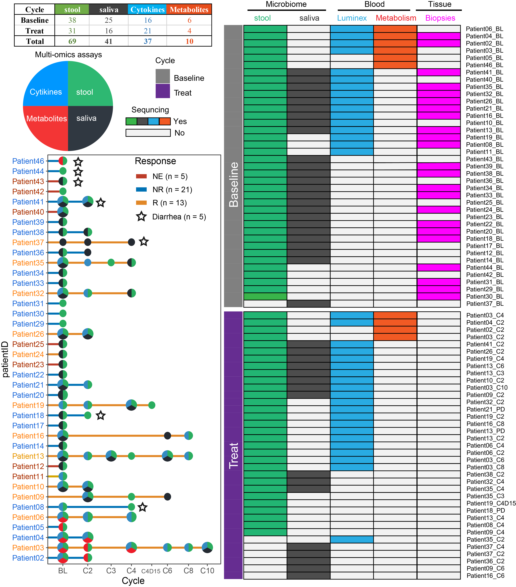
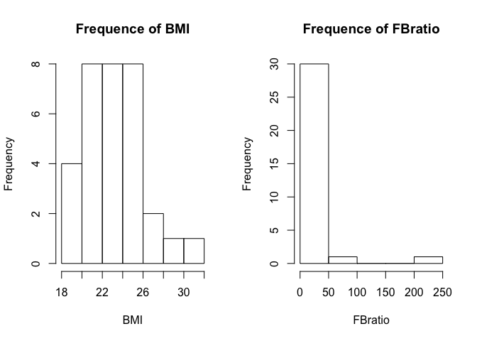

-   [1 Introduction](#introduction)
-   [2 Clinical](#clinical)
-   [3 Samples sequending statistics](#samples-sequending-statistics)
-   [4 Vsisualization](#vsisualization)

=======================================================================
[`Return`](./)

1 Introduction
==============

<table>
<tr>
<td bgcolor="#AFEEEE">
This is introduction
</td>
</tr>
</table>

Requires

    library(tidyverse)
    library(ggthemes)
    library(ggsci)
    library(ggpubr)
    library(survminer)
    library(survival)
    library(survivalROC)
    library(reshape2)
    library(data.table)
    library(ggExtra)
    library(cowplot)
    library(ComplexHeatmap)
    library(scico)
    library(colorspace)
    library(RColorBrewer)
    library(lubridate)
    library(tableone)
    source("../R_function/colors.R")
    source("../R_function/surv_plot.R")
    theme_set(theme_cowplot())
    "%ni%" <- Negate("%in%")
    options(stringsAsFactors = F)

2 Clinical
==========

<a href="../Data/Data/clinical.csv" target="csv">Clinical.csv</a>

    cli<-fread("../Data/Data/clinical.csv",data.table = F)
    factorvars <- colnames(cli)[-c(1:3,23:26)]
    tableone_groups <- CreateTableOne(vars = colnames(cli)[-1],
                                      strata = 'Response',
                                      data = cli, 
                                      factorVars = factorvars)
    table1_groups <- print(x = tableone_groups, 
                           contDigits = 1,     
                           exact = factorvars, 
                           showAllLevels = FALSE, 
                           noSpaces = TRUE, 
                           printToggle = FALSE) 
    knitr::kable(table1_groups,digits = 1,row.names = 1)

<table>
<thead>
<tr class="header">
<th style="text-align: left;"></th>
<th style="text-align: left;">NE</th>
<th style="text-align: left;">NR</th>
<th style="text-align: left;">R</th>
<th style="text-align: left;">p</th>
<th style="text-align: left;">test</th>
</tr>
</thead>
<tbody>
<tr class="odd">
<td style="text-align: left;">n</td>
<td style="text-align: left;">6</td>
<td style="text-align: left;">21</td>
<td style="text-align: left;">13</td>
<td style="text-align: left;"></td>
<td style="text-align: left;"></td>
</tr>
<tr class="even">
<td style="text-align: left;">Response (%)</td>
<td style="text-align: left;"></td>
<td style="text-align: left;"></td>
<td style="text-align: left;"></td>
<td style="text-align: left;">&lt;0.001</td>
<td style="text-align: left;"></td>
</tr>
<tr class="odd">
<td style="text-align: left;">NE</td>
<td style="text-align: left;">6 (100.0)</td>
<td style="text-align: left;">0 (0.0)</td>
<td style="text-align: left;">0 (0.0)</td>
<td style="text-align: left;"></td>
<td style="text-align: left;"></td>
</tr>
<tr class="even">
<td style="text-align: left;">NR</td>
<td style="text-align: left;">0 (0.0)</td>
<td style="text-align: left;">21 (100.0)</td>
<td style="text-align: left;">0 (0.0)</td>
<td style="text-align: left;"></td>
<td style="text-align: left;"></td>
</tr>
<tr class="odd">
<td style="text-align: left;">R</td>
<td style="text-align: left;">0 (0.0)</td>
<td style="text-align: left;">0 (0.0)</td>
<td style="text-align: left;">13 (100.0)</td>
<td style="text-align: left;"></td>
<td style="text-align: left;"></td>
</tr>
<tr class="even">
<td style="text-align: left;">Effect (%)</td>
<td style="text-align: left;"></td>
<td style="text-align: left;"></td>
<td style="text-align: left;"></td>
<td style="text-align: left;">&lt;0.001</td>
<td style="text-align: left;"></td>
</tr>
<tr class="odd">
<td style="text-align: left;">NE</td>
<td style="text-align: left;">6 (100.0)</td>
<td style="text-align: left;">0 (0.0)</td>
<td style="text-align: left;">0 (0.0)</td>
<td style="text-align: left;"></td>
<td style="text-align: left;"></td>
</tr>
<tr class="even">
<td style="text-align: left;">PD</td>
<td style="text-align: left;">0 (0.0)</td>
<td style="text-align: left;">21 (100.0)</td>
<td style="text-align: left;">0 (0.0)</td>
<td style="text-align: left;"></td>
<td style="text-align: left;"></td>
</tr>
<tr class="odd">
<td style="text-align: left;">PR</td>
<td style="text-align: left;">0 (0.0)</td>
<td style="text-align: left;">0 (0.0)</td>
<td style="text-align: left;">5 (38.5)</td>
<td style="text-align: left;"></td>
<td style="text-align: left;"></td>
</tr>
<tr class="even">
<td style="text-align: left;">SD</td>
<td style="text-align: left;">0 (0.0)</td>
<td style="text-align: left;">0 (0.0)</td>
<td style="text-align: left;">8 (61.5)</td>
<td style="text-align: left;"></td>
<td style="text-align: left;"></td>
</tr>
<tr class="odd">
<td style="text-align: left;">Hand_food_syndrom (%)</td>
<td style="text-align: left;"></td>
<td style="text-align: left;"></td>
<td style="text-align: left;"></td>
<td style="text-align: left;">0.347</td>
<td style="text-align: left;">exact</td>
</tr>
<tr class="even">
<td style="text-align: left;">Level0</td>
<td style="text-align: left;">3 (50.0)</td>
<td style="text-align: left;">12 (57.1)</td>
<td style="text-align: left;">3 (23.1)</td>
<td style="text-align: left;"></td>
<td style="text-align: left;"></td>
</tr>
<tr class="odd">
<td style="text-align: left;">Level1</td>
<td style="text-align: left;">1 (16.7)</td>
<td style="text-align: left;">3 (14.3)</td>
<td style="text-align: left;">2 (15.4)</td>
<td style="text-align: left;"></td>
<td style="text-align: left;"></td>
</tr>
<tr class="even">
<td style="text-align: left;">Level2</td>
<td style="text-align: left;">1 (16.7)</td>
<td style="text-align: left;">5 (23.8)</td>
<td style="text-align: left;">4 (30.8)</td>
<td style="text-align: left;"></td>
<td style="text-align: left;"></td>
</tr>
<tr class="odd">
<td style="text-align: left;">Level3</td>
<td style="text-align: left;">1 (16.7)</td>
<td style="text-align: left;">1 (4.8)</td>
<td style="text-align: left;">4 (30.8)</td>
<td style="text-align: left;"></td>
<td style="text-align: left;"></td>
</tr>
<tr class="even">
<td style="text-align: left;">Rash (%)</td>
<td style="text-align: left;"></td>
<td style="text-align: left;"></td>
<td style="text-align: left;"></td>
<td style="text-align: left;">0.836</td>
<td style="text-align: left;">exact</td>
</tr>
<tr class="odd">
<td style="text-align: left;">Level0</td>
<td style="text-align: left;">5 (83.3)</td>
<td style="text-align: left;">13 (61.9)</td>
<td style="text-align: left;">9 (69.2)</td>
<td style="text-align: left;"></td>
<td style="text-align: left;"></td>
</tr>
<tr class="even">
<td style="text-align: left;">Level1</td>
<td style="text-align: left;">0 (0.0)</td>
<td style="text-align: left;">4 (19.0)</td>
<td style="text-align: left;">3 (23.1)</td>
<td style="text-align: left;"></td>
<td style="text-align: left;"></td>
</tr>
<tr class="odd">
<td style="text-align: left;">Level2</td>
<td style="text-align: left;">1 (16.7)</td>
<td style="text-align: left;">2 (9.5)</td>
<td style="text-align: left;">1 (7.7)</td>
<td style="text-align: left;"></td>
<td style="text-align: left;"></td>
</tr>
<tr class="even">
<td style="text-align: left;">Level3</td>
<td style="text-align: left;">0 (0.0)</td>
<td style="text-align: left;">2 (9.5)</td>
<td style="text-align: left;">0 (0.0)</td>
<td style="text-align: left;"></td>
<td style="text-align: left;"></td>
</tr>
<tr class="odd">
<td style="text-align: left;">Fever (%)</td>
<td style="text-align: left;"></td>
<td style="text-align: left;"></td>
<td style="text-align: left;"></td>
<td style="text-align: left;">0.481</td>
<td style="text-align: left;">exact</td>
</tr>
<tr class="even">
<td style="text-align: left;">Level0</td>
<td style="text-align: left;">5 (83.3)</td>
<td style="text-align: left;">18 (85.7)</td>
<td style="text-align: left;">9 (69.2)</td>
<td style="text-align: left;"></td>
<td style="text-align: left;"></td>
</tr>
<tr class="odd">
<td style="text-align: left;">Level1</td>
<td style="text-align: left;">1 (16.7)</td>
<td style="text-align: left;">1 (4.8)</td>
<td style="text-align: left;">1 (7.7)</td>
<td style="text-align: left;"></td>
<td style="text-align: left;"></td>
</tr>
<tr class="even">
<td style="text-align: left;">Level2</td>
<td style="text-align: left;">0 (0.0)</td>
<td style="text-align: left;">2 (9.5)</td>
<td style="text-align: left;">3 (23.1)</td>
<td style="text-align: left;"></td>
<td style="text-align: left;"></td>
</tr>
<tr class="odd">
<td style="text-align: left;">Diarrhea (%)</td>
<td style="text-align: left;"></td>
<td style="text-align: left;"></td>
<td style="text-align: left;"></td>
<td style="text-align: left;">0.957</td>
<td style="text-align: left;">exact</td>
</tr>
<tr class="even">
<td style="text-align: left;">Level0</td>
<td style="text-align: left;">5 (83.3)</td>
<td style="text-align: left;">16 (76.2)</td>
<td style="text-align: left;">12 (92.3)</td>
<td style="text-align: left;"></td>
<td style="text-align: left;"></td>
</tr>
<tr class="odd">
<td style="text-align: left;">Level1</td>
<td style="text-align: left;">1 (16.7)</td>
<td style="text-align: left;">3 (14.3)</td>
<td style="text-align: left;">1 (7.7)</td>
<td style="text-align: left;"></td>
<td style="text-align: left;"></td>
</tr>
<tr class="even">
<td style="text-align: left;">Level2</td>
<td style="text-align: left;">0 (0.0)</td>
<td style="text-align: left;">1 (4.8)</td>
<td style="text-align: left;">0 (0.0)</td>
<td style="text-align: left;"></td>
<td style="text-align: left;"></td>
</tr>
<tr class="odd">
<td style="text-align: left;">Level3</td>
<td style="text-align: left;">0 (0.0)</td>
<td style="text-align: left;">1 (4.8)</td>
<td style="text-align: left;">0 (0.0)</td>
<td style="text-align: left;"></td>
<td style="text-align: left;"></td>
</tr>
<tr class="even">
<td style="text-align: left;">Gender = Male (%)</td>
<td style="text-align: left;">2 (33.3)</td>
<td style="text-align: left;">12 (57.1)</td>
<td style="text-align: left;">7 (53.8)</td>
<td style="text-align: left;">0.623</td>
<td style="text-align: left;">exact</td>
</tr>
<tr class="odd">
<td style="text-align: left;">Age (%)</td>
<td style="text-align: left;"></td>
<td style="text-align: left;"></td>
<td style="text-align: left;"></td>
<td style="text-align: left;">0.243</td>
<td style="text-align: left;">exact</td>
</tr>
<tr class="even">
<td style="text-align: left;">37</td>
<td style="text-align: left;">0 (0.0)</td>
<td style="text-align: left;">0 (0.0)</td>
<td style="text-align: left;">2 (15.4)</td>
<td style="text-align: left;"></td>
<td style="text-align: left;"></td>
</tr>
<tr class="odd">
<td style="text-align: left;">39</td>
<td style="text-align: left;">1 (16.7)</td>
<td style="text-align: left;">0 (0.0)</td>
<td style="text-align: left;">0 (0.0)</td>
<td style="text-align: left;"></td>
<td style="text-align: left;"></td>
</tr>
<tr class="even">
<td style="text-align: left;">42</td>
<td style="text-align: left;">0 (0.0)</td>
<td style="text-align: left;">2 (9.5)</td>
<td style="text-align: left;">0 (0.0)</td>
<td style="text-align: left;"></td>
<td style="text-align: left;"></td>
</tr>
<tr class="odd">
<td style="text-align: left;">44</td>
<td style="text-align: left;">0 (0.0)</td>
<td style="text-align: left;">3 (14.3)</td>
<td style="text-align: left;">1 (7.7)</td>
<td style="text-align: left;"></td>
<td style="text-align: left;"></td>
</tr>
<tr class="even">
<td style="text-align: left;">45</td>
<td style="text-align: left;">0 (0.0)</td>
<td style="text-align: left;">0 (0.0)</td>
<td style="text-align: left;">1 (7.7)</td>
<td style="text-align: left;"></td>
<td style="text-align: left;"></td>
</tr>
<tr class="odd">
<td style="text-align: left;">46</td>
<td style="text-align: left;">0 (0.0)</td>
<td style="text-align: left;">0 (0.0)</td>
<td style="text-align: left;">1 (7.7)</td>
<td style="text-align: left;"></td>
<td style="text-align: left;"></td>
</tr>
<tr class="even">
<td style="text-align: left;">47</td>
<td style="text-align: left;">0 (0.0)</td>
<td style="text-align: left;">0 (0.0)</td>
<td style="text-align: left;">1 (7.7)</td>
<td style="text-align: left;"></td>
<td style="text-align: left;"></td>
</tr>
<tr class="odd">
<td style="text-align: left;">48</td>
<td style="text-align: left;">0 (0.0)</td>
<td style="text-align: left;">2 (9.5)</td>
<td style="text-align: left;">0 (0.0)</td>
<td style="text-align: left;"></td>
<td style="text-align: left;"></td>
</tr>
<tr class="even">
<td style="text-align: left;">49</td>
<td style="text-align: left;">2 (33.3)</td>
<td style="text-align: left;">1 (4.8)</td>
<td style="text-align: left;">0 (0.0)</td>
<td style="text-align: left;"></td>
<td style="text-align: left;"></td>
</tr>
<tr class="odd">
<td style="text-align: left;">51</td>
<td style="text-align: left;">0 (0.0)</td>
<td style="text-align: left;">0 (0.0)</td>
<td style="text-align: left;">1 (7.7)</td>
<td style="text-align: left;"></td>
<td style="text-align: left;"></td>
</tr>
<tr class="even">
<td style="text-align: left;">52</td>
<td style="text-align: left;">1 (16.7)</td>
<td style="text-align: left;">1 (4.8)</td>
<td style="text-align: left;">0 (0.0)</td>
<td style="text-align: left;"></td>
<td style="text-align: left;"></td>
</tr>
<tr class="odd">
<td style="text-align: left;">53</td>
<td style="text-align: left;">0 (0.0)</td>
<td style="text-align: left;">2 (9.5)</td>
<td style="text-align: left;">1 (7.7)</td>
<td style="text-align: left;"></td>
<td style="text-align: left;"></td>
</tr>
<tr class="even">
<td style="text-align: left;">54</td>
<td style="text-align: left;">1 (16.7)</td>
<td style="text-align: left;">0 (0.0)</td>
<td style="text-align: left;">0 (0.0)</td>
<td style="text-align: left;"></td>
<td style="text-align: left;"></td>
</tr>
<tr class="odd">
<td style="text-align: left;">55</td>
<td style="text-align: left;">0 (0.0)</td>
<td style="text-align: left;">2 (9.5)</td>
<td style="text-align: left;">0 (0.0)</td>
<td style="text-align: left;"></td>
<td style="text-align: left;"></td>
</tr>
<tr class="even">
<td style="text-align: left;">56</td>
<td style="text-align: left;">0 (0.0)</td>
<td style="text-align: left;">0 (0.0)</td>
<td style="text-align: left;">1 (7.7)</td>
<td style="text-align: left;"></td>
<td style="text-align: left;"></td>
</tr>
<tr class="odd">
<td style="text-align: left;">57</td>
<td style="text-align: left;">1 (16.7)</td>
<td style="text-align: left;">2 (9.5)</td>
<td style="text-align: left;">1 (7.7)</td>
<td style="text-align: left;"></td>
<td style="text-align: left;"></td>
</tr>
<tr class="even">
<td style="text-align: left;">61</td>
<td style="text-align: left;">0 (0.0)</td>
<td style="text-align: left;">1 (4.8)</td>
<td style="text-align: left;">1 (7.7)</td>
<td style="text-align: left;"></td>
<td style="text-align: left;"></td>
</tr>
<tr class="odd">
<td style="text-align: left;">64</td>
<td style="text-align: left;">0 (0.0)</td>
<td style="text-align: left;">2 (9.5)</td>
<td style="text-align: left;">0 (0.0)</td>
<td style="text-align: left;"></td>
<td style="text-align: left;"></td>
</tr>
<tr class="even">
<td style="text-align: left;">65</td>
<td style="text-align: left;">0 (0.0)</td>
<td style="text-align: left;">2 (9.5)</td>
<td style="text-align: left;">1 (7.7)</td>
<td style="text-align: left;"></td>
<td style="text-align: left;"></td>
</tr>
<tr class="odd">
<td style="text-align: left;">66</td>
<td style="text-align: left;">0 (0.0)</td>
<td style="text-align: left;">0 (0.0)</td>
<td style="text-align: left;">1 (7.7)</td>
<td style="text-align: left;"></td>
<td style="text-align: left;"></td>
</tr>
<tr class="even">
<td style="text-align: left;">69</td>
<td style="text-align: left;">0 (0.0)</td>
<td style="text-align: left;">1 (4.8)</td>
<td style="text-align: left;">0 (0.0)</td>
<td style="text-align: left;"></td>
<td style="text-align: left;"></td>
</tr>
<tr class="odd">
<td style="text-align: left;">BMI (%)</td>
<td style="text-align: left;"></td>
<td style="text-align: left;"></td>
<td style="text-align: left;"></td>
<td style="text-align: left;">1.000</td>
<td style="text-align: left;">exact</td>
</tr>
<tr class="even">
<td style="text-align: left;">18.82</td>
<td style="text-align: left;">0 (0.0)</td>
<td style="text-align: left;">0 (0.0)</td>
<td style="text-align: left;">1 (7.7)</td>
<td style="text-align: left;"></td>
<td style="text-align: left;"></td>
</tr>
<tr class="odd">
<td style="text-align: left;">19.3</td>
<td style="text-align: left;">0 (0.0)</td>
<td style="text-align: left;">0 (0.0)</td>
<td style="text-align: left;">1 (7.7)</td>
<td style="text-align: left;"></td>
<td style="text-align: left;"></td>
</tr>
<tr class="even">
<td style="text-align: left;">19.82</td>
<td style="text-align: left;">0 (0.0)</td>
<td style="text-align: left;">1 (4.8)</td>
<td style="text-align: left;">0 (0.0)</td>
<td style="text-align: left;"></td>
<td style="text-align: left;"></td>
</tr>
<tr class="odd">
<td style="text-align: left;">19.96</td>
<td style="text-align: left;">0 (0.0)</td>
<td style="text-align: left;">1 (4.8)</td>
<td style="text-align: left;">0 (0.0)</td>
<td style="text-align: left;"></td>
<td style="text-align: left;"></td>
</tr>
<tr class="even">
<td style="text-align: left;">20.44</td>
<td style="text-align: left;">0 (0.0)</td>
<td style="text-align: left;">1 (4.8)</td>
<td style="text-align: left;">0 (0.0)</td>
<td style="text-align: left;"></td>
<td style="text-align: left;"></td>
</tr>
<tr class="odd">
<td style="text-align: left;">20.7</td>
<td style="text-align: left;">0 (0.0)</td>
<td style="text-align: left;">1 (4.8)</td>
<td style="text-align: left;">1 (7.7)</td>
<td style="text-align: left;"></td>
<td style="text-align: left;"></td>
</tr>
<tr class="even">
<td style="text-align: left;">20.93</td>
<td style="text-align: left;">0 (0.0)</td>
<td style="text-align: left;">1 (4.8)</td>
<td style="text-align: left;">0 (0.0)</td>
<td style="text-align: left;"></td>
<td style="text-align: left;"></td>
</tr>
<tr class="odd">
<td style="text-align: left;">21.09</td>
<td style="text-align: left;">1 (16.7)</td>
<td style="text-align: left;">0 (0.0)</td>
<td style="text-align: left;">0 (0.0)</td>
<td style="text-align: left;"></td>
<td style="text-align: left;"></td>
</tr>
<tr class="even">
<td style="text-align: left;">21.2</td>
<td style="text-align: left;">0 (0.0)</td>
<td style="text-align: left;">1 (4.8)</td>
<td style="text-align: left;">0 (0.0)</td>
<td style="text-align: left;"></td>
<td style="text-align: left;"></td>
</tr>
<tr class="odd">
<td style="text-align: left;">21.3</td>
<td style="text-align: left;">0 (0.0)</td>
<td style="text-align: left;">1 (4.8)</td>
<td style="text-align: left;">0 (0.0)</td>
<td style="text-align: left;"></td>
<td style="text-align: left;"></td>
</tr>
<tr class="even">
<td style="text-align: left;">21.34</td>
<td style="text-align: left;">1 (16.7)</td>
<td style="text-align: left;">0 (0.0)</td>
<td style="text-align: left;">0 (0.0)</td>
<td style="text-align: left;"></td>
<td style="text-align: left;"></td>
</tr>
<tr class="odd">
<td style="text-align: left;">21.36</td>
<td style="text-align: left;">1 (16.7)</td>
<td style="text-align: left;">1 (4.8)</td>
<td style="text-align: left;">0 (0.0)</td>
<td style="text-align: left;"></td>
<td style="text-align: left;"></td>
</tr>
<tr class="even">
<td style="text-align: left;">21.41</td>
<td style="text-align: left;">0 (0.0)</td>
<td style="text-align: left;">0 (0.0)</td>
<td style="text-align: left;">1 (7.7)</td>
<td style="text-align: left;"></td>
<td style="text-align: left;"></td>
</tr>
<tr class="odd">
<td style="text-align: left;">21.45</td>
<td style="text-align: left;">1 (16.7)</td>
<td style="text-align: left;">0 (0.0)</td>
<td style="text-align: left;">0 (0.0)</td>
<td style="text-align: left;"></td>
<td style="text-align: left;"></td>
</tr>
<tr class="even">
<td style="text-align: left;">21.46</td>
<td style="text-align: left;">0 (0.0)</td>
<td style="text-align: left;">1 (4.8)</td>
<td style="text-align: left;">0 (0.0)</td>
<td style="text-align: left;"></td>
<td style="text-align: left;"></td>
</tr>
<tr class="odd">
<td style="text-align: left;">22.31</td>
<td style="text-align: left;">0 (0.0)</td>
<td style="text-align: left;">1 (4.8)</td>
<td style="text-align: left;">0 (0.0)</td>
<td style="text-align: left;"></td>
<td style="text-align: left;"></td>
</tr>
<tr class="even">
<td style="text-align: left;">22.65</td>
<td style="text-align: left;">1 (16.7)</td>
<td style="text-align: left;">0 (0.0)</td>
<td style="text-align: left;">0 (0.0)</td>
<td style="text-align: left;"></td>
<td style="text-align: left;"></td>
</tr>
<tr class="odd">
<td style="text-align: left;">22.72</td>
<td style="text-align: left;">0 (0.0)</td>
<td style="text-align: left;">1 (4.8)</td>
<td style="text-align: left;">0 (0.0)</td>
<td style="text-align: left;"></td>
<td style="text-align: left;"></td>
</tr>
<tr class="even">
<td style="text-align: left;">23.31</td>
<td style="text-align: left;">0 (0.0)</td>
<td style="text-align: left;">0 (0.0)</td>
<td style="text-align: left;">1 (7.7)</td>
<td style="text-align: left;"></td>
<td style="text-align: left;"></td>
</tr>
<tr class="odd">
<td style="text-align: left;">23.42</td>
<td style="text-align: left;">0 (0.0)</td>
<td style="text-align: left;">0 (0.0)</td>
<td style="text-align: left;">1 (7.7)</td>
<td style="text-align: left;"></td>
<td style="text-align: left;"></td>
</tr>
<tr class="even">
<td style="text-align: left;">23.61</td>
<td style="text-align: left;">0 (0.0)</td>
<td style="text-align: left;">1 (4.8)</td>
<td style="text-align: left;">0 (0.0)</td>
<td style="text-align: left;"></td>
<td style="text-align: left;"></td>
</tr>
<tr class="odd">
<td style="text-align: left;">23.62</td>
<td style="text-align: left;">0 (0.0)</td>
<td style="text-align: left;">0 (0.0)</td>
<td style="text-align: left;">1 (7.7)</td>
<td style="text-align: left;"></td>
<td style="text-align: left;"></td>
</tr>
<tr class="even">
<td style="text-align: left;">23.88</td>
<td style="text-align: left;">0 (0.0)</td>
<td style="text-align: left;">1 (4.8)</td>
<td style="text-align: left;">0 (0.0)</td>
<td style="text-align: left;"></td>
<td style="text-align: left;"></td>
</tr>
<tr class="odd">
<td style="text-align: left;">23.92</td>
<td style="text-align: left;">0 (0.0)</td>
<td style="text-align: left;">1 (4.8)</td>
<td style="text-align: left;">0 (0.0)</td>
<td style="text-align: left;"></td>
<td style="text-align: left;"></td>
</tr>
<tr class="even">
<td style="text-align: left;">23.99</td>
<td style="text-align: left;">0 (0.0)</td>
<td style="text-align: left;">0 (0.0)</td>
<td style="text-align: left;">1 (7.7)</td>
<td style="text-align: left;"></td>
<td style="text-align: left;"></td>
</tr>
<tr class="odd">
<td style="text-align: left;">24.68</td>
<td style="text-align: left;">0 (0.0)</td>
<td style="text-align: left;">1 (4.8)</td>
<td style="text-align: left;">0 (0.0)</td>
<td style="text-align: left;"></td>
<td style="text-align: left;"></td>
</tr>
<tr class="even">
<td style="text-align: left;">24.69</td>
<td style="text-align: left;">0 (0.0)</td>
<td style="text-align: left;">1 (4.8)</td>
<td style="text-align: left;">0 (0.0)</td>
<td style="text-align: left;"></td>
<td style="text-align: left;"></td>
</tr>
<tr class="odd">
<td style="text-align: left;">25.15</td>
<td style="text-align: left;">0 (0.0)</td>
<td style="text-align: left;">0 (0.0)</td>
<td style="text-align: left;">1 (7.7)</td>
<td style="text-align: left;"></td>
<td style="text-align: left;"></td>
</tr>
<tr class="even">
<td style="text-align: left;">25.33</td>
<td style="text-align: left;">0 (0.0)</td>
<td style="text-align: left;">0 (0.0)</td>
<td style="text-align: left;">1 (7.7)</td>
<td style="text-align: left;"></td>
<td style="text-align: left;"></td>
</tr>
<tr class="odd">
<td style="text-align: left;">25.39</td>
<td style="text-align: left;">0 (0.0)</td>
<td style="text-align: left;">0 (0.0)</td>
<td style="text-align: left;">1 (7.7)</td>
<td style="text-align: left;"></td>
<td style="text-align: left;"></td>
</tr>
<tr class="even">
<td style="text-align: left;">25.51</td>
<td style="text-align: left;">0 (0.0)</td>
<td style="text-align: left;">1 (4.8)</td>
<td style="text-align: left;">0 (0.0)</td>
<td style="text-align: left;"></td>
<td style="text-align: left;"></td>
</tr>
<tr class="odd">
<td style="text-align: left;">25.89</td>
<td style="text-align: left;">1 (16.7)</td>
<td style="text-align: left;">0 (0.0)</td>
<td style="text-align: left;">0 (0.0)</td>
<td style="text-align: left;"></td>
<td style="text-align: left;"></td>
</tr>
<tr class="even">
<td style="text-align: left;">25.95</td>
<td style="text-align: left;">0 (0.0)</td>
<td style="text-align: left;">0 (0.0)</td>
<td style="text-align: left;">1 (7.7)</td>
<td style="text-align: left;"></td>
<td style="text-align: left;"></td>
</tr>
<tr class="odd">
<td style="text-align: left;">25.97</td>
<td style="text-align: left;">0 (0.0)</td>
<td style="text-align: left;">0 (0.0)</td>
<td style="text-align: left;">1 (7.7)</td>
<td style="text-align: left;"></td>
<td style="text-align: left;"></td>
</tr>
<tr class="even">
<td style="text-align: left;">26.78</td>
<td style="text-align: left;">0 (0.0)</td>
<td style="text-align: left;">1 (4.8)</td>
<td style="text-align: left;">0 (0.0)</td>
<td style="text-align: left;"></td>
<td style="text-align: left;"></td>
</tr>
<tr class="odd">
<td style="text-align: left;">27.34</td>
<td style="text-align: left;">0 (0.0)</td>
<td style="text-align: left;">1 (4.8)</td>
<td style="text-align: left;">0 (0.0)</td>
<td style="text-align: left;"></td>
<td style="text-align: left;"></td>
</tr>
<tr class="even">
<td style="text-align: left;">28.32</td>
<td style="text-align: left;">0 (0.0)</td>
<td style="text-align: left;">1 (4.8)</td>
<td style="text-align: left;">0 (0.0)</td>
<td style="text-align: left;"></td>
<td style="text-align: left;"></td>
</tr>
<tr class="odd">
<td style="text-align: left;">31.77</td>
<td style="text-align: left;">0 (0.0)</td>
<td style="text-align: left;">1 (4.8)</td>
<td style="text-align: left;">0 (0.0)</td>
<td style="text-align: left;"></td>
<td style="text-align: left;"></td>
</tr>
<tr class="even">
<td style="text-align: left;">History = yes (%)</td>
<td style="text-align: left;">0 (0.0)</td>
<td style="text-align: left;">7 (33.3)</td>
<td style="text-align: left;">4 (30.8)</td>
<td style="text-align: left;">0.276</td>
<td style="text-align: left;">exact</td>
</tr>
<tr class="odd">
<td style="text-align: left;">Smoking = yes (%)</td>
<td style="text-align: left;">1 (16.7)</td>
<td style="text-align: left;">3 (14.3)</td>
<td style="text-align: left;">2 (15.4)</td>
<td style="text-align: left;">1.000</td>
<td style="text-align: left;">exact</td>
</tr>
<tr class="even">
<td style="text-align: left;">Dringking = yes (%)</td>
<td style="text-align: left;">0 (0.0)</td>
<td style="text-align: left;">2 (9.5)</td>
<td style="text-align: left;">3 (23.1)</td>
<td style="text-align: left;">0.417</td>
<td style="text-align: left;">exact</td>
</tr>
<tr class="odd">
<td style="text-align: left;">anitEGFR = yes (%)</td>
<td style="text-align: left;">3 (50.0)</td>
<td style="text-align: left;">4 (19.0)</td>
<td style="text-align: left;">5 (38.5)</td>
<td style="text-align: left;">0.289</td>
<td style="text-align: left;">exact</td>
</tr>
<tr class="even">
<td style="text-align: left;">antiVEGF = yes (%)</td>
<td style="text-align: left;">2 (33.3)</td>
<td style="text-align: left;">14 (66.7)</td>
<td style="text-align: left;">7 (53.8)</td>
<td style="text-align: left;">0.316</td>
<td style="text-align: left;">exact</td>
</tr>
<tr class="odd">
<td style="text-align: left;">LiverM = yes (%)</td>
<td style="text-align: left;">4 (66.7)</td>
<td style="text-align: left;">16 (76.2)</td>
<td style="text-align: left;">8 (61.5)</td>
<td style="text-align: left;">0.642</td>
<td style="text-align: left;">exact</td>
</tr>
<tr class="even">
<td style="text-align: left;">LungM = yes (%)</td>
<td style="text-align: left;">4 (66.7)</td>
<td style="text-align: left;">12 (57.1)</td>
<td style="text-align: left;">8 (61.5)</td>
<td style="text-align: left;">1.000</td>
<td style="text-align: left;">exact</td>
</tr>
<tr class="odd">
<td style="text-align: left;">LymphM = yes (%)</td>
<td style="text-align: left;">3 (50.0)</td>
<td style="text-align: left;">10 (47.6)</td>
<td style="text-align: left;">5 (38.5)</td>
<td style="text-align: left;">0.911</td>
<td style="text-align: left;">exact</td>
</tr>
<tr class="even">
<td style="text-align: left;">PeritonealM = yes (%)</td>
<td style="text-align: left;">0 (0.0)</td>
<td style="text-align: left;">6 (28.6)</td>
<td style="text-align: left;">4 (30.8)</td>
<td style="text-align: left;">0.415</td>
<td style="text-align: left;">exact</td>
</tr>
<tr class="odd">
<td style="text-align: left;">OtherM = yes (%)</td>
<td style="text-align: left;">0 (0.0)</td>
<td style="text-align: left;">4 (19.0)</td>
<td style="text-align: left;">2 (15.4)</td>
<td style="text-align: left;">0.838</td>
<td style="text-align: left;">exact</td>
</tr>
<tr class="even">
<td style="text-align: left;">MetastasisNum (%)</td>
<td style="text-align: left;"></td>
<td style="text-align: left;"></td>
<td style="text-align: left;"></td>
<td style="text-align: left;">0.081</td>
<td style="text-align: left;">exact</td>
</tr>
<tr class="odd">
<td style="text-align: left;">1</td>
<td style="text-align: left;">2 (33.3)</td>
<td style="text-align: left;">3 (14.3)</td>
<td style="text-align: left;">6 (46.2)</td>
<td style="text-align: left;"></td>
<td style="text-align: left;"></td>
</tr>
<tr class="even">
<td style="text-align: left;">2</td>
<td style="text-align: left;">3 (50.0)</td>
<td style="text-align: left;">9 (42.9)</td>
<td style="text-align: left;">2 (15.4)</td>
<td style="text-align: left;"></td>
<td style="text-align: left;"></td>
</tr>
<tr class="odd">
<td style="text-align: left;">3</td>
<td style="text-align: left;">1 (16.7)</td>
<td style="text-align: left;">9 (42.9)</td>
<td style="text-align: left;">3 (23.1)</td>
<td style="text-align: left;"></td>
<td style="text-align: left;"></td>
</tr>
<tr class="even">
<td style="text-align: left;">4</td>
<td style="text-align: left;">0 (0.0)</td>
<td style="text-align: left;">0 (0.0)</td>
<td style="text-align: left;">2 (15.4)</td>
<td style="text-align: left;"></td>
<td style="text-align: left;"></td>
</tr>
<tr class="odd">
<td style="text-align: left;">Location = right (%)</td>
<td style="text-align: left;">2 (33.3)</td>
<td style="text-align: left;">7 (33.3)</td>
<td style="text-align: left;">4 (30.8)</td>
<td style="text-align: left;">1.000</td>
<td style="text-align: left;">exact</td>
</tr>
<tr class="even">
<td style="text-align: left;">PFS (mean (SD))</td>
<td style="text-align: left;">0.8 (0.4)</td>
<td style="text-align: left;">1.0 (0.0)</td>
<td style="text-align: left;">0.8 (0.4)</td>
<td style="text-align: left;">0.080</td>
<td style="text-align: left;"></td>
</tr>
<tr class="odd">
<td style="text-align: left;">OS (mean (SD))</td>
<td style="text-align: left;">0.3 (0.5)</td>
<td style="text-align: left;">0.4 (0.5)</td>
<td style="text-align: left;">0.2 (0.4)</td>
<td style="text-align: left;">0.266</td>
<td style="text-align: left;"></td>
</tr>
<tr class="even">
<td style="text-align: left;">PFStime (mean (SD))</td>
<td style="text-align: left;">5.4 (1.6)</td>
<td style="text-align: left;">1.9 (0.4)</td>
<td style="text-align: left;">6.2 (2.1)</td>
<td style="text-align: left;">&lt;0.001</td>
<td style="text-align: left;"></td>
</tr>
<tr class="odd">
<td style="text-align: left;">OStime (mean (SD))</td>
<td style="text-align: left;">7.4 (1.9)</td>
<td style="text-align: left;">6.8 (2.8)</td>
<td style="text-align: left;">9.5 (2.7)</td>
<td style="text-align: left;">0.023</td>
<td style="text-align: left;"></td>
</tr>
</tbody>
</table>

3 Samples sequending statistics
===============================

    data<-fread("../Data/Data/samples_seqInfo.csv",data.table = F)
    

4 Vsisualization
================

    df<-fread("../Data/Data/Phylum_cli_111samples.csv",data.table = F)
    df$FBratio<-df$Firmicutes/df$Bacteroidetes
    df$FBratio_g<-ifelse(df$FBratio>=median(df$FBratio),"High","Low")
    data<-subset(df,Site=="Stool"&Response!="NE"&Cycle=="BL")
    par(mfrow=c(1,2))
    hist(data$BMI,main="Frequence of BMI",xlab = "BMI")
    hist(data$FBratio,main="Frequence of FBratio",xlab = "FBratio")

    data$BMI_g<-ifelse(data$BMI>25,"High","Low")
    data$FBratio_g<-ifelse(data$FBratio>median(data$FBratio),"High","Low")
    fit<-survfit(Surv(PFStime,PFS) ~ BMI_g,
                       data = data)
    fit

    ## Call: survfit(formula = Surv(PFStime, PFS) ~ BMI_g, data = data)
    ## 
    ##             n events median 0.95LCL 0.95UCL
    ## BMI_g=High 10      8   3.28    2.20      NA
    ## BMI_g=Low  22     21   1.97    1.87     4.2

    ggsurvplot(fit, data=data,xlab = "Time(months)",conf.int = T,tables.theme = theme_few(base_size = 10),
               linetype = "strata",
                    legend.title = "",palette = c("black","red"),
                    risk.table = T,
                    #legend = c(0.84, 0.8),
                    pval = TRUE,pval.size = 4, 
                    pval.coord=c(0.8,0.2),pval.method=F,
                    pval.method.coord=c(0.05,0.3), 
                    ggtheme = theme_minimal() + 
                      theme(line = element_line(size = 0.1),
                            text  = element_text(size = 8)),
                    risk.table.col = "strata",
                    surv.median.line = "hv",
                    risk.table.y.text.col = T,
                    risk.table.y.text = FALSE )

    p1<-ggscatter(subset(df,Cycle=="BL"&Response!="NE"&FBratio<10), x = "FBratio", y = "BMI",size=0.5,mean.point = T,
              color = "Site", add.params = list(c(size=0.5,color="Site")),
              add = "reg.line", conf.int = TRUE)+
      stat_cor(label.x = 0.3,aes(color=Site))+
      theme_few(base_size = 8)+
      scale_color_aaas()+
      scale_color_manual(values = col11)

    ## Scale for 'colour' is already present. Adding another scale for 'colour',
    ## which will replace the existing scale.

    p2<-ggscatter(subset(df,Cycle=="BL"&Response!="NE"), x = "Firmicutes", y = "Bacteroidetes",size=0.5,mean.point = T,
              color = "Site", add.params = list(c(size=0.5,color="Site")),
              add = "reg.line", conf.int = TRUE)+
      stat_cor(label.x = 0.2,aes(color=Site))+
      theme_few(base_size = 8)+
      scale_color_aaas()

    p3<-ggstatsplot::ggbarstats(data = data,x=Response,ggtheme = ggplot2::theme_bw(base_size=8),bias.correct = T,
                            y =FBratio_g,subtitle = F,results.subtitle=F,
                            ggstatsplot.layer = FALSE,
                            legend.position="right",
                            messages = FALSE,
                            package = "ggsci",
                            palette = "default_nejm",
                            main = Response, nboot = 100,
                            legend.title = "Response")

    ## Registered S3 methods overwritten by 'lme4':
    ##   method                          from
    ##   cooks.distance.influence.merMod car 
    ##   influence.merMod                car 
    ##   dfbeta.influence.merMod         car 
    ##   dfbetas.influence.merMod        car

    plot_grid(p1,p2, p3,labels = c("A","B","C"), ncol =3, nrow = 1)

    ## `geom_smooth()` using formula 'y ~ x'

    ## `geom_smooth()` using formula 'y ~ x'

    df <- fread("../Data/Data/paired_BL_treat_16patients.csv", data.table = F)

    df$Hand_food_syndrom <- as.factor(df$Hand_food_syndrom)
    df$Hand_food_syndrom_g <- ifelse(df$Hand_food_syndrom %in% c("0", "1"), "no", "yes")
    df$Rash <- as.factor(df$Rash)
    df$Rash_g <- ifelse(df$Rash == "0", "no", "yes")
    df$Fever <- as.factor(df$Fever)
    df$Fever_g <- ifelse(df$Fever == "0", "no", "yes")
    df$Diarrhea <- as.factor(df$Diarrhea)
    df$Diarrhea_g <- ifelse(df$Diarrhea == "0", "no", "yes")

    df_treat <- subset(df, Group == "Treat")
    # List of ggsurvplots
    require("survminer")
    splots <- list()

    fit_PFS <- survfit(Surv(PFStime, PFS) ~ Hand_food_syndrom_g, data = df_treat)
    fit_PFS
    fit_OS <- survfit(Surv(OStime, OS) ~ Hand_food_syndrom_g, data = df_treat)
    fit_OS
    splots[[1]] <- surv_plot(fit_PFS, df_treat, colors = c("darkgreen", "darkorange"), 
        title = "HandFoodSyndrom_PFS")
    ## Loading required package: prodlim
    splots[[2]] <- surv_plot(fit_OS, df_treat, colors = c("black", "red"), title = "HandFoodSyndrom_OS")

    fit_PFS <- survfit(Surv(PFStime, PFS) ~ Rash_g, data = df_treat)
    fit_PFS
    fit_OS <- survfit(Surv(OStime, OS) ~ Rash_g, data = df_treat)
    fit_OS
    splots[[3]] <- surv_plot(fit_PFS, df_treat, colors = c("darkgreen", "darkorange"), 
        title = "Rash_PFS")
    splots[[4]] <- surv_plot(fit_OS, df_treat, colors = c("black", "red"), title = "Rash_OS")

    fit_PFS <- survfit(Surv(PFStime, PFS) ~ Fever_g, data = df_treat)
    fit_PFS
    fit_OS <- survfit(Surv(OStime, OS) ~ Fever_g, data = df_treat)
    fit_OS
    splots[[5]] <- surv_plot(fit_PFS, df_treat, colors = c("darkgreen", "darkorange"), 
        title = "Fever_PFS")
    splots[[6]] <- surv_plot(fit_OS, df_treat, colors = c("black", "red"), title = "Fever_OS")
    fit_PFS <- survfit(Surv(PFStime, PFS) ~ Diarrhea_g, data = df_treat)
    fit_PFS
    fit_OS <- survfit(Surv(OStime, OS) ~ Diarrhea_g, data = df_treat)
    fit_OS
    splots[[7]] <- surv_plot(fit_PFS, df_treat, colors = c("darkgreen", "darkorange"), 
        title = "Diarrhea_PFS")
    splots[[8]] <- surv_plot(fit_OS, df_treat, colors = c("black", "red"), title = "Diarrhea_OS")
    arrange_ggsurvplots(splots, print = TRUE, ncol = 4, nrow = 2)

    bar1 <- ggplot(df, aes(Group, Desulfovibrionaceae, fill = Response)) + geom_boxplot() + 
        geom_line(aes(group = patientID, color = Response, size = Desulfovibrionaceae), 
            alpha = 0.5) + geom_point(aes(size = Desulfovibrionaceae), color = "darkblue", 
        alpha = 0.5) + theme_few(base_size = 8) + stat_compare_means(label = "p.signif") + 
        scale_fill_d3() + theme(legend.key = element_blank(), axis.title.x = element_blank())
    bar2 <- ggplot(df, aes(Group, Desulfovibrionaceae, fill = Diarrhea_g)) + geom_boxplot() + 
        geom_line(aes(group = patientID, color = Diarrhea_g, size = Desulfovibrionaceae), 
            alpha = 0.5) + geom_point(aes(size = Desulfovibrionaceae), color = "darkblue", 
        alpha = 0.5) + theme_few(base_size = 8) + stat_compare_means(label = "p.signif") + 
        scale_fill_jama() + theme(legend.key = element_blank(), axis.title.x = element_blank())
    ## Call: survfit(formula = Surv(PFStime, PFS) ~ Hand_food_syndrom_g, data = df_treat)
    ## 
    ##                         n events median 0.95LCL 0.95UCL
    ## Hand_food_syndrom_g=no  7      7    2.3    1.97      NA
    ## Hand_food_syndrom_g=yes 9      7    4.2    2.20      NA
    ## Call: survfit(formula = Surv(OStime, OS) ~ Hand_food_syndrom_g, data = df_treat)
    ## 
    ##                         n events median 0.95LCL 0.95UCL
    ## Hand_food_syndrom_g=no  7      2     NA    5.17      NA
    ## Hand_food_syndrom_g=yes 9      3   15.5   10.33      NA
    ## Call: survfit(formula = Surv(PFStime, PFS) ~ Rash_g, data = df_treat)
    ## 
    ##             n events median 0.95LCL 0.95UCL
    ## Rash_g=no  11     10   3.80    2.03      NA
    ## Rash_g=yes  5      4   4.23    2.20      NA
    ## Call: survfit(formula = Surv(OStime, OS) ~ Rash_g, data = df_treat)
    ## 
    ##             n events median 0.95LCL 0.95UCL
    ## Rash_g=no  11      3   10.3    10.3      NA
    ## Rash_g=yes  5      2   15.5    15.5      NA
    ## Call: survfit(formula = Surv(PFStime, PFS) ~ Fever_g, data = df_treat)
    ## 
    ##              n events median 0.95LCL 0.95UCL
    ## Fever_g=no  14     12   3.05    2.03      NA
    ## Fever_g=yes  2      2   5.28    4.23      NA
    ## Call: survfit(formula = Surv(OStime, OS) ~ Fever_g, data = df_treat)
    ## 
    ##              n events median 0.95LCL 0.95UCL
    ## Fever_g=no  14      4   15.5    15.5      NA
    ## Fever_g=yes  2      1   10.3      NA      NA
    ## Call: survfit(formula = Surv(PFStime, PFS) ~ Diarrhea_g, data = df_treat)
    ## 
    ##                 n events median 0.95LCL 0.95UCL
    ## Diarrhea_g=no  13     11   4.23    2.30      NA
    ## Diarrhea_g=yes  3      3   1.97    1.87      NA
    ## Call: survfit(formula = Surv(OStime, OS) ~ Diarrhea_g, data = df_treat)
    ## 
    ##                 n events median 0.95LCL 0.95UCL
    ## Diarrhea_g=no  13      4   15.5    10.3      NA
    ## Diarrhea_g=yes  3      1     NA     3.9      NA

    plot_grid(bar1, bar2, labels = c("A", "B"), ncol = 2, nrow = 1)

