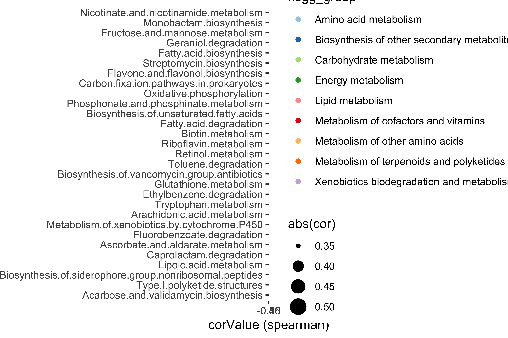

-   [1 BMI related features](#bmi-related-features)
    -   [1.1 BMI and FBratio of gut
        microbiome](#bmi-and-fbratio-of-gut-microbiome)
        -   [1.1.1 Histgrams for BMI and
            FBartio](#histgrams-for-bmi-and-fbartio)
        -   [1.1.2 PFS survival plot for
            BMI](#pfs-survival-plot-for-bmi)
        -   [1.1.3 Correlation of BMI and gut
            FBratio](#correlation-of-bmi-and-gut-fbratio)
    -   [1.2 Correlation of BMI and stroma CD3
        expression](#correlation-of-bmi-and-stroma-cd3-expression)
    -   [1.3 BMI ralated KEGG pathways](#bmi-ralated-kegg-pathways)
    -   [1.4 Validate the clinical value of gut FBratio with public
        datasets](#validate-the-clinical-value-of-gut-fbratio-with-public-datasets)
        -   [1.4.1 Correlation Firmucutes and
            Bacteroidetes](#correlation-firmucutes-and-bacteroidetes)
        -   [1.4.2 Diagnostic value of Gut FBratio in CRC
            cohorts](#diagnostic-value-of-gut-fbratio-in-crc-cohorts)
        -   [1.4.3 Gut FBratio in
            immunotherapy](#gut-fbratio-in-immunotherapy)
-   [2 Treated-related aderse events](#treated-related-aderse-events)
    -   [2.1 PFS survival curves for each
        events](#pfs-survival-curves-for-each-events)
    -   [2.2 Abundance of Diarrhea-related
        *Desulfovibrionaceae*](#abundance-of-diarrhea-related-desulfovibrionaceae)

[`Return`](./)

1 BMI related features
======================

Requires

    library(tidyverse)
    library(ggthemes)
    library(ggsci)
    library(ggpubr)
    library(survminer)
    library(survival)
    library(survivalROC)
    library(reshape2)
    library(data.table)
    library(ggExtra)
    library(cowplot)
    library(ComplexHeatmap)
    library(scico)
    library(colorspace)
    library(RColorBrewer)
    library(lubridate)
    library(tableone)
    library(kableExtra)
    source("../R_function/colors.R")
    source("../R_function/surv_plot.R")
    theme_set(theme_cowplot())
    "%ni%" <- Negate("%in%")
    options(stringsAsFactors = F)

1.1 BMI and FBratio of gut microbiome
-------------------------------------

### 1.1.1 Histgrams for BMI and FBartio

    df<-fread("../Data/Data/Phylum_cli_111samples.csv",data.table = F)
    df$FBratio<-df$Firmicutes/df$Bacteroidetes
    df$FBratio_g<-ifelse(df$FBratio>=median(df$FBratio),"High","Low")
    data<-subset(df,Site=="Stool"&Response!="NE"&Cycle=="BL")
    par(mfrow=c(1,2))
    hist(data$BMI,main="Frequence of BMI",xlab = "BMI")
    hist(data$FBratio,main="Frequence of FBratio",xlab = "FBratio")

    data$BMI_g<-ifelse(data$BMI>25,"High","Low")
    data$FBratio_g<-ifelse(data$FBratio>median(data$FBratio),"High","Low")
    fit<-survfit(Surv(PFStime,PFS) ~ BMI_g,
                       data = data)
    fit

    ## Call: survfit(formula = Surv(PFStime, PFS) ~ BMI_g, data = data)
    ## 
    ##             n events median 0.95LCL 0.95UCL
    ## BMI_g=High 10      8   3.28    2.20      NA
    ## BMI_g=Low  22     21   1.97    1.87     4.2

### 1.1.2 PFS survival plot for BMI

    ggsurvplot(fit, data=data,xlab = "Time(months)",
               censor.size=0.5, size = 0.5,
               tables.theme = theme_few(base_size = 5),
               legend.labs = c(">25", "<=25"),
                    legend.title = "BMI",palette = c("red","black"),
                    risk.table = T,
                    pval = TRUE,pval.size = 3, 
                    pval.coord=c(0.8,0.2),pval.method=F,
                    pval.method.coord=c(0.05,0.3), 
                    ggtheme = theme_minimal() + 
                      theme(line = element_line(size = 0.1),
                            text  = element_text(size = 6)),
                    risk.table.col = "strata",
                    surv.median.line = "hv",
                    risk.table.y.text.col = T,
                    risk.table.y.text = FALSE )

### 1.1.3 Correlation of BMI and gut FBratio

    p1<-ggscatter(subset(df,Cycle=="BL"&Response!="NE"&FBratio<10), x = "FBratio", y = "BMI",size=0.5,mean.point = T,
              color = "Site", add.params = list(c(size=0.5,color="Site")),
              add = "reg.line", conf.int = TRUE)+
      stat_cor(label.x = 0.3,aes(color=Site))+
      theme_few(base_size = 8)+
      scale_color_aaas()

    p2<-ggscatter(subset(df,Cycle=="BL"&Response!="NE"), x = "Firmicutes", y = "Bacteroidetes",size=0.5,mean.point = T,
              color = "Site", add.params = list(c(size=0.5,color="Site")),
              add = "reg.line", conf.int = TRUE)+
      stat_cor(label.x = 0.2,aes(color=Site))+
      theme_few(base_size = 8)+
      scale_color_aaas()

    p3<-ggstatsplot::ggbarstats(data = data,x=Response,ggtheme = ggplot2::theme_bw(base_size=8),bias.correct = T,
                            y =FBratio_g,subtitle = F,results.subtitle=T,
                            ggstatsplot.layer = FALSE,
                            legend.position="right",
                            messages = FALSE,
                            package = "ggsci",
                            palette = "default_nejm",
                            main = Response, nboot = 100,
                            legend.title = "Response")

    ## Registered S3 methods overwritten by 'lme4':
    ##   method                          from
    ##   cooks.distance.influence.merMod car 
    ##   influence.merMod                car 
    ##   dfbeta.influence.merMod         car 
    ##   dfbetas.influence.merMod        car

    plot_grid(p1,p2, p3,labels = c("A","B","C"), ncol =3, nrow = 1)

    ## `geom_smooth()` using formula 'y ~ x'

    ## `geom_smooth()` using formula 'y ~ x'

1.2 Correlation of BMI and stroma CD3 expression
------------------------------------------------

    bmi<-fread("../Data/Data/BMI_CD3.csv",data.table = F)
    ggscatter(bmi,x = "value", y = "BMI",size=1,mean.point = T,
              add.params = list(c(size=0.5,color="variable")),color="variable",
              add = "reg.line", conf.int = TRUE)+
      stat_cor(aes(color=variable),label.x = 3)+
      facet_wrap(~variable,scales = "free")+
      theme_few(base_size = 8)+
      scale_color_aaas()

1.3 BMI ralated KEGG pathways
-----------------------------

1.4 Validate the clinical value of gut FBratio with public datasets
-------------------------------------------------------------------

### 1.4.1 Correlation Firmucutes and Bacteroidetes

    df1<-fread("../Data/Data/publicData/PRJNA541981_phylum.csv",data.table = F)
    df2<-fread("../Data/Data/publicData/PRJEB22863_phylum.csv",data.table = F)
    df3<-fread("../Data/Data/publicData/PRJNA399742_phylum.csv",data.table = F)
    df4<-fread("../Data/Data/publicData/gFBratio_subsetCRC_810samples.csv",data.table = F)
    colnames(df4)[c(2,3)]=c("Cancer","datasets")
    colnames(df3)[1]="samples"
    colnames(df4)[1]="samples"
    index<-colnames(df4)[-9]
    data<-bind_rows(select(df1,index),select(df2,index),select(df3,index),select(df4,index))
    p1<-ggscatter(data, x = "Firmicutes", 
              y = "Bacteroidetes",size=1,alpha=0.4,color="datasets",cor.method = "spearman",mean.point = T,
              palette = "jco",add.params = list(alpha=0.5,size=1), ggtheme = theme_few(base_size = 8),
              add = "reg.line", conf.int = TRUE)+
      stat_cor(aes(color=datasets),label.x = 0.55,size=6)+
      theme(legend.text = element_text(size=8))

    p2<-ggscatter(data, x = "Firmicutes", mean.point = T,cor.method = "spearman",
              ggtheme = theme_few(base_size = 8),
              y = "Bacteroidetes",size=1,alpha=0.4,color="Cancer",
              palette = "jco",add.params = list(alpha=0.5,size=1),
              add = "reg.line", conf.int = TRUE)+
      stat_cor(aes(color=Cancer),label.x = 0.55,size=6)+
      theme(legend.text = element_text(size=8))

    plot_grid(p1,p2,labels = c("A","B"), ncol =2, nrow = 1)

### 1.4.2 Diagnostic value of Gut FBratio in CRC cohorts

### 1.4.3 Gut FBratio in immunotherapy

2 Treated-related aderse events
===============================

2.1 PFS survival curves for each events
---------------------------------------

    df <- fread("../Data/Data/paired_BL_treat_16patients.csv", data.table = F)

    df$Hand_food_syndrom <- as.factor(df$Hand_food_syndrom)
    df$Hand_food_syndrom_g <- ifelse(df$Hand_food_syndrom %in% c("0", "1"), "no", "yes")
    df$Rash <- as.factor(df$Rash)
    df$Rash_g <- ifelse(df$Rash == "0", "no", "yes")
    df$Fever <- as.factor(df$Fever)
    df$Fever_g <- ifelse(df$Fever == "0", "no", "yes")
    df$Diarrhea <- as.factor(df$Diarrhea)
    df$Diarrhea_g <- ifelse(df$Diarrhea == "0", "no", "yes")

    df_treat <- subset(df, Group == "Treat")
    # List of ggsurvplots

    splots <- list()
    fit_PFS <- survfit(Surv(PFStime, PFS) ~ Hand_food_syndrom_g, data = df_treat)
    fit_PFS
    fit_OS <- survfit(Surv(OStime, OS) ~ Hand_food_syndrom_g, data = df_treat)
    fit_OS
    splots[[1]] <- surv_plot(fit_PFS, df_treat, colors = c("darkgreen", "darkorange"), 
        title = "HandFoodSyndrom_PFS")
    ## Loading required package: prodlim
    splots[[2]] <- surv_plot(fit_OS, df_treat, colors = c("black", "red"), title = "HandFoodSyndrom_OS")

    fit_PFS <- survfit(Surv(PFStime, PFS) ~ Rash_g, data = df_treat)
    fit_PFS
    fit_OS <- survfit(Surv(OStime, OS) ~ Rash_g, data = df_treat)
    fit_OS
    splots[[3]] <- surv_plot(fit_PFS, df_treat, colors = c("darkgreen", "darkorange"), 
        title = "Rash_PFS")
    splots[[4]] <- surv_plot(fit_OS, df_treat, colors = c("black", "red"), title = "Rash_OS")

    fit_PFS <- survfit(Surv(PFStime, PFS) ~ Fever_g, data = df_treat)
    fit_PFS
    fit_OS <- survfit(Surv(OStime, OS) ~ Fever_g, data = df_treat)
    fit_OS
    splots[[5]] <- surv_plot(fit_PFS, df_treat, colors = c("darkgreen", "darkorange"), 
        title = "Fever_PFS")
    splots[[6]] <- surv_plot(fit_OS, df_treat, colors = c("black", "red"), title = "Fever_OS")
    fit_PFS <- survfit(Surv(PFStime, PFS) ~ Diarrhea_g, data = df_treat)
    fit_PFS
    fit_OS <- survfit(Surv(OStime, OS) ~ Diarrhea_g, data = df_treat)
    fit_OS
    splots[[7]] <- surv_plot(fit_PFS, df_treat, colors = c("darkgreen", "darkorange"), 
        title = "Diarrhea_PFS")
    splots[[8]] <- surv_plot(fit_OS, df_treat, colors = c("black", "red"), title = "Diarrhea_OS")
    require(survminer)
    arrange_ggsurvplots(x = splots, print = TRUE, ncol = 3, nrow = 3)

    ## Call: survfit(formula = Surv(PFStime, PFS) ~ Hand_food_syndrom_g, data = df_treat)
    ## 
    ##                         n events median 0.95LCL 0.95UCL
    ## Hand_food_syndrom_g=no  7      7    2.3    1.97      NA
    ## Hand_food_syndrom_g=yes 9      7    4.2    2.20      NA
    ## Call: survfit(formula = Surv(OStime, OS) ~ Hand_food_syndrom_g, data = df_treat)
    ## 
    ##                         n events median 0.95LCL 0.95UCL
    ## Hand_food_syndrom_g=no  7      2     NA    5.17      NA
    ## Hand_food_syndrom_g=yes 9      3   15.5   10.33      NA
    ## Call: survfit(formula = Surv(PFStime, PFS) ~ Rash_g, data = df_treat)
    ## 
    ##             n events median 0.95LCL 0.95UCL
    ## Rash_g=no  11     10   3.80    2.03      NA
    ## Rash_g=yes  5      4   4.23    2.20      NA
    ## Call: survfit(formula = Surv(OStime, OS) ~ Rash_g, data = df_treat)
    ## 
    ##             n events median 0.95LCL 0.95UCL
    ## Rash_g=no  11      3   10.3    10.3      NA
    ## Rash_g=yes  5      2   15.5    15.5      NA
    ## Call: survfit(formula = Surv(PFStime, PFS) ~ Fever_g, data = df_treat)
    ## 
    ##              n events median 0.95LCL 0.95UCL
    ## Fever_g=no  14     12   3.05    2.03      NA
    ## Fever_g=yes  2      2   5.28    4.23      NA
    ## Call: survfit(formula = Surv(OStime, OS) ~ Fever_g, data = df_treat)
    ## 
    ##              n events median 0.95LCL 0.95UCL
    ## Fever_g=no  14      4   15.5    15.5      NA
    ## Fever_g=yes  2      1   10.3      NA      NA
    ## Call: survfit(formula = Surv(PFStime, PFS) ~ Diarrhea_g, data = df_treat)
    ## 
    ##                 n events median 0.95LCL 0.95UCL
    ## Diarrhea_g=no  13     11   4.23    2.30      NA
    ## Diarrhea_g=yes  3      3   1.97    1.87      NA
    ## Call: survfit(formula = Surv(OStime, OS) ~ Diarrhea_g, data = df_treat)
    ## 
    ##                 n events median 0.95LCL 0.95UCL
    ## Diarrhea_g=no  13      4   15.5    10.3      NA
    ## Diarrhea_g=yes  3      1     NA     3.9      NA

2.2 Abundance of Diarrhea-related *Desulfovibrionaceae*
-------------------------------------------------------

    bar1<-ggplot(df,aes(Group,Desulfovibrionaceae,fill=Response))+
      geom_boxplot()+
      geom_line(aes(group=patientID,color=Response,size=Desulfovibrionaceae),alpha=0.5)+
      geom_point(aes(size=Desulfovibrionaceae),color="darkblue",alpha=0.5)+
      theme_few(base_size = 8)+
      stat_compare_means(label = "p.signif")+
      scale_fill_d3()+
      theme(legend.key = element_blank(),
            axis.title.x = element_blank())
    bar2<-ggplot(df,aes(Group,Desulfovibrionaceae,fill=Diarrhea_g))+
      geom_boxplot()+
      geom_line(aes(group=patientID,color=Diarrhea_g,size=Desulfovibrionaceae),alpha=0.5)+
      geom_point(aes(size=Desulfovibrionaceae),color="darkblue",alpha=0.5)+
      theme_few(base_size = 8)+
      stat_compare_means(label = "p.signif")+
      scale_fill_jama()+
      theme(legend.key = element_blank(),
            axis.title.x = element_blank())

    plot_grid(bar1, bar2, labels = c("A", "B"), ncol = 2, nrow = 1)

