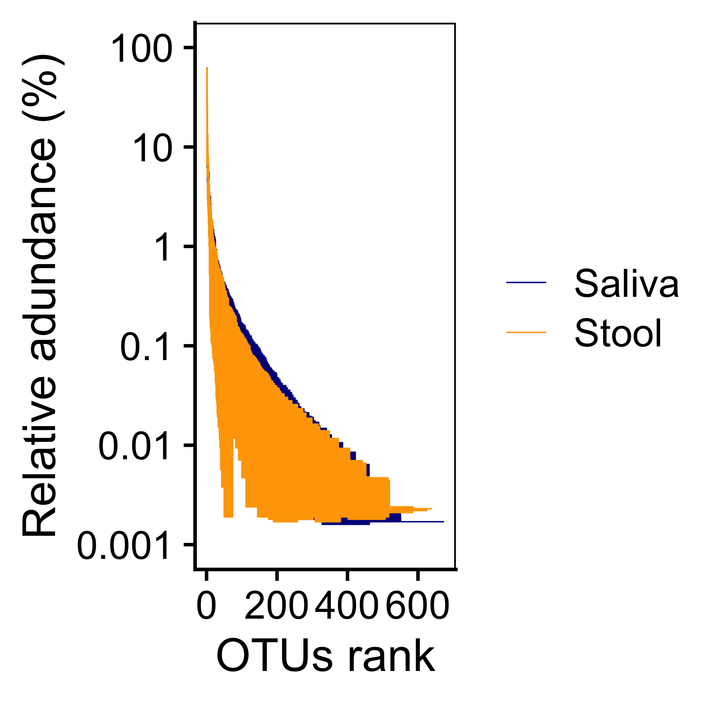

-   [1 Summary](#summary)
    -   [1.1 OTU聚类步骤如下：](#otu聚类步骤如下)
    -   [1.2 Code](#code)
-   [2 Rank-Abundance](#rank-abundance)
    -   [2.1 Code](#code-1)
        -   [2.1.1 Shannon-Winne](#shannon-winne)
-   [3 Pan/Core物种分析](#pancore物种分析)
    -   [3.1 Code](#code-2)
    -   [3.2 Including Plots](#including-plots)

================

Requires

    library(tidyverse)
    library(ggthemes)
    library(ggsci)
    library(ggpubr)
    library(survminer)
    library(survival)
    library(survivalROC)
    library(reshape2)
    library(data.table)
    library(ggExtra)
    library(cowplot)
    library(ComplexHeatmap)
    library(scico)
    library(colorspace)
    library(RColorBrewer)
    library(lubridate)
    library(tableone)
    library(kableExtra)
    library(BiodiversityR)
    source("../R_function/colors.R")
    source("../R_function/surv_plot.R")
    theme_set(theme_cowplot())
    "%ni%" <- Negate("%in%")
    options(stringsAsFactors = F)

1 Summary
=========

OTU（Operational
TaxonomicUnits）是在系统发生学或群体遗传学研究中，为了便于进行分析，人为给某一个分类单元（品系，属，种、分组等）设置的统一标志。要了解一个样本测序结果中的菌种、菌属等数目信息，就需要对序列进行聚类（cluster）。通过聚类操作，将序列按照彼此的相似性分归为许多小组，一个小组就是一个OTU。可根据不同的相似度水平，对所有序列进行OTU划分，通常对97%相似水平下的OTU进行生物信息统计分析。

软件平台：Uparse（vsesion 7.1
<a href="http://drive5.com/uparse/" class="uri">http://drive5.com/uparse/</a>）

1.1 OTU聚类步骤如下：
---------------------

1.  对优化序列提取非重复序列，便于降低分析中间过程冗余计算量（<a href="http://drive5.com/usearch/manual/dereplication.html" class="uri">http://drive5.com/usearch/manual/dereplication.html</a>）；
    2）去除没有重复的单序列（<a href="http://drive5.com/usearch/manual/singletons.html" class="uri">http://drive5.com/usearch/manual/singletons.html</a>)；
    3）按照97%相似性对非重复序列（不含单序列）进行OTU聚类，在聚类过程中去除嵌合体，得到OTU的代表序列;
    4）将所有优化序列map至OTU代表序列，选出与代表序列相似性在97%以上的序列，生成OTU表格。

1.2 Code
--------

2 Rank-Abundance
================

Rank-Abundance
曲线是分析多样性的一种方式。构建方法是统计每个样本中，每个OTU所含的序列数，将OTUs按丰度（所含有的序列条数）由大到小等级排序，再以OTU的排序等级为横坐标，以每个OTU中所含的序列数（也可用OTU中序列数的相对百分含量）为纵坐标作图。

Rank-Abundance曲线可用来解释多样性的两个方面，即物种丰富度和群落均匀度。在水平方向，物种的丰富度由曲线的宽度来反映，曲线在横轴上的范围越大，物种的丰富度就越高；曲线的形状（平缓程度）反映了样本中群落的均匀度，曲线越平缓，物种分布越均匀。

2.1 Code
--------

### 2.1.1 Shannon-Winne

    otu<-fread("../Data/Data/OTUtable_ori.csv",data.table = F)
    meta<-fread("../Data/Data/meta.csv",data.table = F)
    otu<-t(data.frame(row.names = otu$OTU,otu[,-1]))
    otu_relative <- otu / rowSums(otu)
    rank_dat <- data.frame()
    for (i in rownames(otu_relative)) {
      rank_dat_i <- data.frame(rankabundance(subset(otu_relative, 
                                                    rownames(otu_relative) == i), 
                                             digits = 6))[1:2]
      rank_dat_i$sample <- i
      rank_dat <- rbind(rank_dat, rank_dat_i)
    }

    ## Warning in qt(0.975, df = n - 1): 产生了NaNs

    ## Warning in qt(0.975, df = n - 1): 产生了NaNs

    ## Warning in qt(0.975, df = n - 1): 产生了NaNs

    ## Warning in qt(0.975, df = n - 1): 产生了NaNs

    ## Warning in qt(0.975, df = n - 1): 产生了NaNs

    ## Warning in qt(0.975, df = n - 1): 产生了NaNs

    ## Warning in qt(0.975, df = n - 1): 产生了NaNs

    ## Warning in qt(0.975, df = n - 1): 产生了NaNs

    ## Warning in qt(0.975, df = n - 1): 产生了NaNs

    ## Warning in qt(0.975, df = n - 1): 产生了NaNs

    ## Warning in qt(0.975, df = n - 1): 产生了NaNs

    ## Warning in qt(0.975, df = n - 1): 产生了NaNs

    ## Warning in qt(0.975, df = n - 1): 产生了NaNs

    ## Warning in qt(0.975, df = n - 1): 产生了NaNs

    ## Warning in qt(0.975, df = n - 1): 产生了NaNs

    ## Warning in qt(0.975, df = n - 1): 产生了NaNs

    ## Warning in qt(0.975, df = n - 1): 产生了NaNs

    ## Warning in qt(0.975, df = n - 1): 产生了NaNs

    ## Warning in qt(0.975, df = n - 1): 产生了NaNs

    ## Warning in qt(0.975, df = n - 1): 产生了NaNs

    ## Warning in qt(0.975, df = n - 1): 产生了NaNs

    ## Warning in qt(0.975, df = n - 1): 产生了NaNs

    ## Warning in qt(0.975, df = n - 1): 产生了NaNs

    ## Warning in qt(0.975, df = n - 1): 产生了NaNs

    ## Warning in qt(0.975, df = n - 1): 产生了NaNs

    ## Warning in qt(0.975, df = n - 1): 产生了NaNs

    ## Warning in qt(0.975, df = n - 1): 产生了NaNs

    ## Warning in qt(0.975, df = n - 1): 产生了NaNs

    ## Warning in qt(0.975, df = n - 1): 产生了NaNs

    ## Warning in qt(0.975, df = n - 1): 产生了NaNs

    ## Warning in qt(0.975, df = n - 1): 产生了NaNs

    ## Warning in qt(0.975, df = n - 1): 产生了NaNs

    ## Warning in qt(0.975, df = n - 1): 产生了NaNs

    ## Warning in qt(0.975, df = n - 1): 产生了NaNs

    ## Warning in qt(0.975, df = n - 1): 产生了NaNs

    ## Warning in qt(0.975, df = n - 1): 产生了NaNs

    ## Warning in qt(0.975, df = n - 1): 产生了NaNs

    ## Warning in qt(0.975, df = n - 1): 产生了NaNs

    ## Warning in qt(0.975, df = n - 1): 产生了NaNs

    ## Warning in qt(0.975, df = n - 1): 产生了NaNs

    ## Warning in qt(0.975, df = n - 1): 产生了NaNs

    ## Warning in qt(0.975, df = n - 1): 产生了NaNs

    ## Warning in qt(0.975, df = n - 1): 产生了NaNs

    ## Warning in qt(0.975, df = n - 1): 产生了NaNs

    ## Warning in qt(0.975, df = n - 1): 产生了NaNs

    ## Warning in qt(0.975, df = n - 1): 产生了NaNs

    ## Warning in qt(0.975, df = n - 1): 产生了NaNs

    ## Warning in qt(0.975, df = n - 1): 产生了NaNs

    ## Warning in qt(0.975, df = n - 1): 产生了NaNs

    ## Warning in qt(0.975, df = n - 1): 产生了NaNs

    ## Warning in qt(0.975, df = n - 1): 产生了NaNs

    ## Warning in qt(0.975, df = n - 1): 产生了NaNs

    ## Warning in qt(0.975, df = n - 1): 产生了NaNs

    ## Warning in qt(0.975, df = n - 1): 产生了NaNs

    ## Warning in qt(0.975, df = n - 1): 产生了NaNs

    ## Warning in qt(0.975, df = n - 1): 产生了NaNs

    ## Warning in qt(0.975, df = n - 1): 产生了NaNs

    ## Warning in qt(0.975, df = n - 1): 产生了NaNs

    ## Warning in qt(0.975, df = n - 1): 产生了NaNs

    ## Warning in qt(0.975, df = n - 1): 产生了NaNs

    ## Warning in qt(0.975, df = n - 1): 产生了NaNs

    ## Warning in qt(0.975, df = n - 1): 产生了NaNs

    ## Warning in qt(0.975, df = n - 1): 产生了NaNs

    ## Warning in qt(0.975, df = n - 1): 产生了NaNs

    ## Warning in qt(0.975, df = n - 1): 产生了NaNs

    ## Warning in qt(0.975, df = n - 1): 产生了NaNs

    ## Warning in qt(0.975, df = n - 1): 产生了NaNs

    ## Warning in qt(0.975, df = n - 1): 产生了NaNs

    ## Warning in qt(0.975, df = n - 1): 产生了NaNs

    ## Warning in qt(0.975, df = n - 1): 产生了NaNs

    ## Warning in qt(0.975, df = n - 1): 产生了NaNs

    ## Warning in qt(0.975, df = n - 1): 产生了NaNs

    ## Warning in qt(0.975, df = n - 1): 产生了NaNs

    ## Warning in qt(0.975, df = n - 1): 产生了NaNs

    ## Warning in qt(0.975, df = n - 1): 产生了NaNs

    ## Warning in qt(0.975, df = n - 1): 产生了NaNs

    ## Warning in qt(0.975, df = n - 1): 产生了NaNs

    ## Warning in qt(0.975, df = n - 1): 产生了NaNs

    ## Warning in qt(0.975, df = n - 1): 产生了NaNs

    ## Warning in qt(0.975, df = n - 1): 产生了NaNs

    ## Warning in qt(0.975, df = n - 1): 产生了NaNs

    ## Warning in qt(0.975, df = n - 1): 产生了NaNs

    ## Warning in qt(0.975, df = n - 1): 产生了NaNs

    ## Warning in qt(0.975, df = n - 1): 产生了NaNs

    ## Warning in qt(0.975, df = n - 1): 产生了NaNs

    ## Warning in qt(0.975, df = n - 1): 产生了NaNs

    ## Warning in qt(0.975, df = n - 1): 产生了NaNs

    ## Warning in qt(0.975, df = n - 1): 产生了NaNs

    ## Warning in qt(0.975, df = n - 1): 产生了NaNs

    ## Warning in qt(0.975, df = n - 1): 产生了NaNs

    ## Warning in qt(0.975, df = n - 1): 产生了NaNs

    ## Warning in qt(0.975, df = n - 1): 产生了NaNs

    ## Warning in qt(0.975, df = n - 1): 产生了NaNs

    ## Warning in qt(0.975, df = n - 1): 产生了NaNs

    ## Warning in qt(0.975, df = n - 1): 产生了NaNs

    ## Warning in qt(0.975, df = n - 1): 产生了NaNs

    ## Warning in qt(0.975, df = n - 1): 产生了NaNs

    ## Warning in qt(0.975, df = n - 1): 产生了NaNs

    ## Warning in qt(0.975, df = n - 1): 产生了NaNs

    ## Warning in qt(0.975, df = n - 1): 产生了NaNs

    ## Warning in qt(0.975, df = n - 1): 产生了NaNs

    ## Warning in qt(0.975, df = n - 1): 产生了NaNs

    ## Warning in qt(0.975, df = n - 1): 产生了NaNs

    ## Warning in qt(0.975, df = n - 1): 产生了NaNs

    ## Warning in qt(0.975, df = n - 1): 产生了NaNs

    ## Warning in qt(0.975, df = n - 1): 产生了NaNs

    ## Warning in qt(0.975, df = n - 1): 产生了NaNs

    ## Warning in qt(0.975, df = n - 1): 产生了NaNs

    ## Warning in qt(0.975, df = n - 1): 产生了NaNs

    ## Warning in qt(0.975, df = n - 1): 产生了NaNs

    ## Warning in qt(0.975, df = n - 1): 产生了NaNs

    rank_dat <- subset(rank_dat, abundance != 0)
    colnames(rank_dat)[3]="Samples"
    rank_dat<-merge(rank_dat,meta,by="Samples")
    p<-ggplot(rank_dat, aes(rank, log(abundance, 10), color = Site)) +
      geom_line(size=0.2) +
      scale_colour_manual(limits = c('Saliva','Stool'), values = c('darkblue','orange')) +
      labs(x = 'OTUs rank', y = 'Relative adundance (%)', color = NULL) +
      theme(panel.grid = element_blank(), panel.background = element_rect(fill = 'transparent', color = 'black'), legend.key = element_rect(fill = 'transparent')) +
      scale_y_continuous(breaks = 0:-5, labels = c('100', '10', '1', '0.1', '0.01', '0.001'), limits = c(-5, 0))

    p

3 Pan/Core物种分析
==================

Pan/Core物种分析用于描述随着样本量增加物种总量和核心物种量变化的情况，在微生物多样性和群落研究中，被广泛用于判断样本量是否充足以及评估环境中总物种丰富度(
species
richness)和核心物种数。Pan/Core物种分析可以在各分类学水平上进行，包括domain（域），kingdom（界），phylum（门），class（纲），order（目），family（科），genus（属），species（种），OTU等。

Pan物种，即泛物种，是所有样本包含的物种总和，用于观测随着样本数目增加，总物种数目的增加情况。

Core物种，即核心物种，是所有样本共有物种数目，用于观测随着样本数目增加，共有物种数目的减少情况。

3.1 Code
--------

    summary(cars)

    ##      speed           dist       
    ##  Min.   : 4.0   Min.   :  2.00  
    ##  1st Qu.:12.0   1st Qu.: 26.00  
    ##  Median :15.0   Median : 36.00  
    ##  Mean   :15.4   Mean   : 42.98  
    ##  3rd Qu.:19.0   3rd Qu.: 56.00  
    ##  Max.   :25.0   Max.   :120.00

3.2 Including Plots
-------------------

You can also embed plots, for example:

Note that the `echo = FALSE` parameter was added to the code chunk to
prevent printing of the R code that generated the plot.
