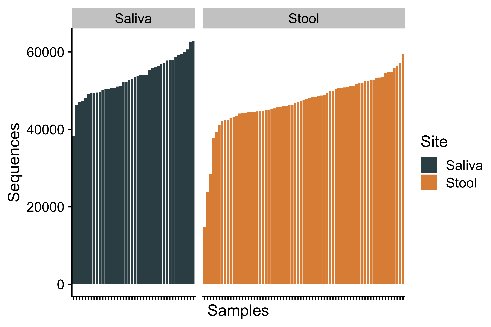
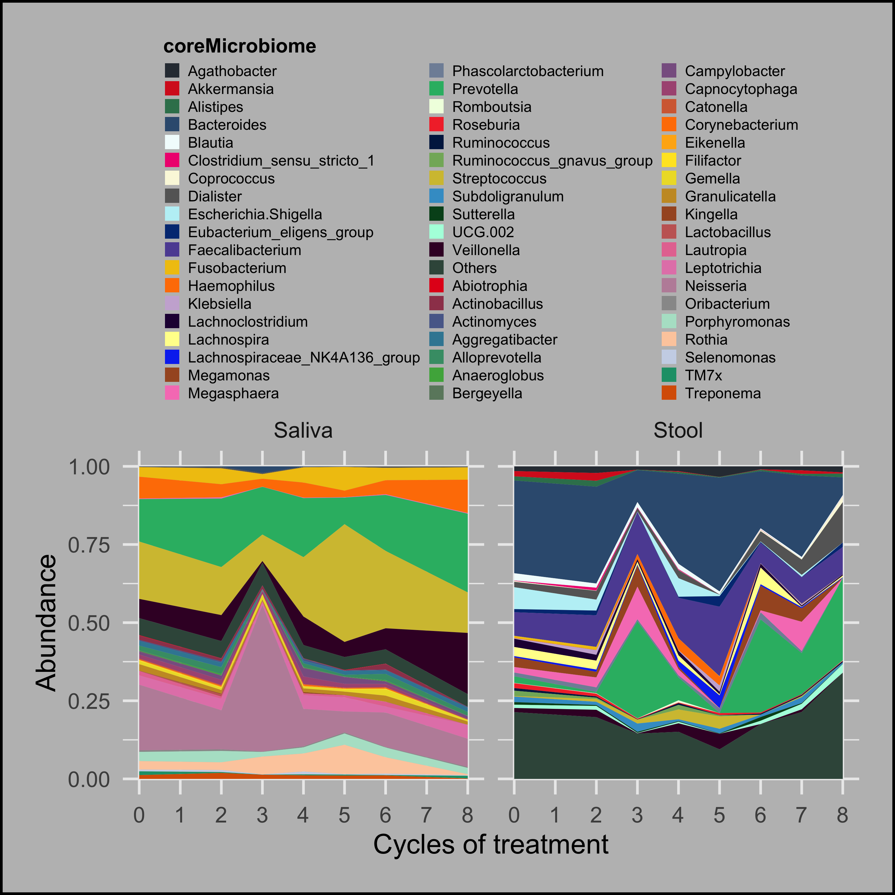
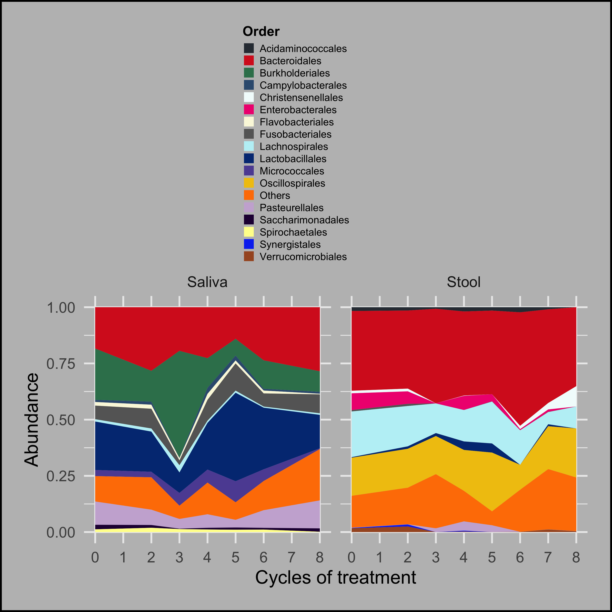

-   [1 OTUanalysis](#otuanalysis)
    -   [1.1 Requires](#requires)
    -   [1.2 Summary](#summary)
        -   [1.2.1 OTU（Operational Taxonomic
            Units）](#otuoperational-taxonomic-units)
        -   [1.2.2 Code](#code)
    -   [1.3 Rank-Abundance](#rank-abundance)
        -   [1.3.1 Code](#code-1)
        -   [1.3.2 Figures](#figures)
        -   [1.3.3 Taxon annotation](#taxon-annotation)
-   [2 Pan/Core物种分析](#pancore物种分析)
    -   [2.1 Microbiome compostion](#microbiome-compostion)
        -   [2.1.1 Code](#code-2)
        -   [2.1.2 Figures](#figures-1)

1 OTUanalysis
=============

=========

1.1 Requires
------------

Requires

    library(tidyverse)
    library(ggthemes)
    library(ggsci)
    library(ggpubr)
    library(survminer)
    library(survival)
    library(survivalROC)
    library(reshape2)
    library(data.table)
    library(ggExtra)
    library(cowplot)
    library(ComplexHeatmap)
    library(scico)
    library(colorspace)
    library(RColorBrewer)
    library(lubridate)
    library(tableone)
    library(kableExtra)
    library(BiodiversityR)
    library(reactable)
    source("../R_function/colors.R")
    source("../R_function/surv_plot.R")
    theme_set(theme_cowplot())
    "%ni%" <- Negate("%in%")
    options(stringsAsFactors = F)

1.2 Summary
-----------

### 1.2.1 OTU（Operational Taxonomic Units）

In 16S metagenomics approaches, OTUs are cluster of similar sequence
variants of the 16S rDNA marker gene sequence. Each of these cluster is
intended to represent a taxonomic unit of a bacteria species or genus
depending on the sequence similarity threshold. Typically, OTU cluster
are defined by a 97% identity threshold of the 16S gene sequences to
distinguish bacteria at the genus level.

#### 1.2.1.1 Limited taxonomic resolution

OTU resolution depends on the 16S approach which has some limits in
distinguishing at the species level

### 1.2.2 Code

1.3 Rank-Abundance
------------------

A rank abundance curve or Whittaker plot is a chart used by ecologists
to display relative species abundance, a component of biodiversity. It
can also be used to visualize species richness and species evenness. It
overcomes the shortcomings of biodiversity indices that cannot display
the relative role different variables played in their calculation.

### 1.3.1 Code

    otu<-fread("../Data/Data/OTUtable_ori.csv",data.table = F)
    meta<-fread("../Data/Data/meta.csv",data.table = F)
    otu<-t(data.frame(row.names = otu$OTU,otu[,-1]))
    otu_relative <- otu / rowSums(otu)
    rank_dat <- data.frame()
    for (i in rownames(otu_relative)) {
      rank_dat_i <- data.frame(rankabundance(subset(otu_relative, 
                                                    rownames(otu_relative) == i), 
                                             digits = 6))[1:2]
      rank_dat_i$sample <- i
      rank_dat <- rbind(rank_dat, rank_dat_i)
    }
    rank_dat <- subset(rank_dat, abundance != 0)
    colnames(rank_dat)[3]="Samples"
    rank_dat<-merge(rank_dat,meta,by="Samples")
    p<-ggplot(rank_dat, aes(rank, log(abundance, 10), color = Site)) +
      geom_line(size=0.2) +
      scale_colour_manual(limits = c('Saliva','Stool'), values = c('darkblue','orange')) +
      labs(x = 'OTUs rank', y = 'Relative adundance (%)', color = NULL) +
      theme(panel.grid = element_blank(), panel.background = element_rect(fill = 'transparent', color = 'black'), legend.key = element_rect(fill = 'transparent')) +
      scale_y_continuous(breaks = 0:-5, labels = c('100', '10', '1', '0.1', '0.01', '0.001'), limits = c(-5, 0))

### 1.3.2 Figures

    p

\#\#\# Effective sequences

    ggplot(meta,aes(reorder(Samples,Sequences),Sequences,fill=Site))+
      geom_col()+
      scale_fill_jama()+
      facet_grid(~Site,scales = "free",space = "free")+
      theme(axis.text.x = element_blank())+
      xlab("Samples")

### 1.3.3 Taxon annotation

    OTUstool<-fread("../Data/Data/OTUtabale_regaStool.csv",data.table = F)
    OTUsaliva<-fread("../Data/Data/OTUtabale_regaSaliva.csv",data.table = F)
    message("Taxon number on stool samples")

    ## Taxon number on stool samples

    for (i in 1:7) {

      print(paste0(colnames(OTUstool)[i],":",
                     length(levels(factor(OTUstool[,i])))))
    }

    ## [1] "Phylum:11"
    ## [1] "Class:17"
    ## [1] "Order:40"
    ## [1] "Family:71"
    ## [1] "Genus:188"
    ## [1] "Species:433"
    ## [1] "OTU:1260"

    message("Taxon number on saliva samples")

    ## Taxon number on saliva samples

    for (i in 1:7) {
      
      print(paste0(colnames(OTUsaliva)[i],":",
                     length(levels(factor(OTUsaliva[,i])))))
    }

    ## [1] "Phylum:11"
    ## [1] "Class:18"
    ## [1] "Order:45"
    ## [1] "Family:77"
    ## [1] "Genus:151"
    ## [1] "Species:362"
    ## [1] "OTU:722"

2 Pan/Core物种分析
==================

Pan/Core物种分析用于描述随着样本量增加物种总量和核心物种量变化的情况，在微生物多样性和群落研究中，被广泛用于判断样本量是否充足以及评估环境中总物种丰富度(
species
richness)和核心物种数。Pan/Core物种分析可以在各分类学水平上进行，包括domain（域），kingdom（界），phylum（门），class（纲），order（目），family（科），genus（属），species（种），OTU等。

Pan物种，即泛物种，是所有样本包含的物种总和，用于观测随着样本数目增加，总物种数目的增加情况。

Core物种，即核心物种，是所有样本共有物种数目，用于观测随着样本数目增加，共有物种数目的减少情况。

One of the aims of the Human Microbiome Project when established in 2007
was to identify a human ‘core microbiome’, defined as a group of
microbial taxa or genes that are shared by all or most humans (Hamady &
Knight, 2009; Turnbaugh et al., 2007). These pioneering studies found
that a universal taxonomic core rarely exists across groups of humans,
even at the scale of the family unit (Yatsunenko et al., 2012), yet most
shared the same set of core microbial genes. This pattern appears to be
similar for most host species studied to date, with variable microbial
composition often underpinned by similar gene context across individuals
(Burke, Steinberg, Rusch, Kjelleberg, & Thomas, 2011; Louca et al.,
2018). Nevertheless, most ecologists aim to understand host–microbe
interactions at the organismal level, accounting for microbe functional
traits where possible; therefore, within this field, the core microbiome
has been largely applied to taxonomically defined microbial communities
with an aim to identify groups of microbes that are particularly
widespread across the host population (e.g. Ainsworth et al., 2015;
Grieneisen, Livermore, Alberts, Tung, & Archie, 2017; Hernandez‐Agreda,
Gates, & Ainsworth, 2017; Kembel et al., 2014; Lundberg et al., 2012;
Muletz Wolz, Yarwood, Campbell Grant, Fleischer, & Lips, 2018).

ref:Applying the core microbiome to understand host–microbe systems.J
Anim Ecol. 2020;89:1549–1558 (2020).
<a href="https://doi.org/10.1111/1365-2656.13229" class="uri">https://doi.org/10.1111/1365-2656.13229</a>

ref: Turnbaugh, P., Hamady, M., Yatsunenko, T. et al. A core gut
microbiome in obese and lean twins. Nature 457, 480–484 (2009).
<a href="https://doi.org/10.1038/nature07540" class="uri">https://doi.org/10.1038/nature07540</a>

Within an individual oral cavity, we found over 3600 unique sequences,
over 500 different OTUs or “species-level” phylotypes (sequences that
clustered at 3% genetic difference) and 88 - 104 higher taxa (genus or
more inclusive taxon). The predominant taxa belonged to Firmicutes
(genus Streptococcus, family Veillonellaceae, genus Granulicatella),
Proteobacteria (genus Neisseria, Haemophilus), Actinobacteria (genus
Corynebacterium, Rothia, Actinomyces), Bacteroidetes (genus Prevotella,
Capnocytophaga, Porphyromonas) and Fusobacteria (genus Fusobacterium).

ref:Zaura, E., Keijser, B.J., Huse, S.M. et al. Defining the healthy
“core microbiome” of oral microbial communities. BMC Microbiol 9, 259
(2009).
<a href="https://doi.org/10.1186/1471-2180-9-259" class="uri">https://doi.org/10.1186/1471-2180-9-259</a>

2.1 Microbiome compostion
-------------------------

### 2.1.1 Code

    meta<-fread("../Data/Data/meta.csv",data.table = F)
    meta$Cycle<-factor(meta$Cycle,levels = c("BL","C2","C3","C4","C5","C6","C8","C10"))
    meta$Time<-meta$Cycle
    meta$Time<-ifelse(meta$Time=="BL",1,meta$Time)
    meta$Time<-gsub("C","",meta$Time)
    meta$Time<-as.numeric(meta$Time)

    OTUstool<-fread("../Data/Data/OTUtabale_regaStool.csv",data.table = F)
    OTUsaliva<-fread("../Data/Data/OTUtabale_regaSaliva.csv",data.table = F)
    TaxonLevels<-colnames(OTUstool)[1:7]
    OTUanalysis<-function(OTUtable,TaxonLevels,topTaxonomyABvalue){
      OTU_readsList<-list()
      OTU_abundanceList<-list()
      for (i in seq_along(TaxonLevels)) {
        OTU_readsList[[i]]<-data.frame(Microname=OTUtable[,grep(TaxonLevels[i],colnames(OTUtable))],OTUtable[,-c(1:7)])
        colnames(OTU_readsList[[i]])[1]="Microname"
        OTU_readsList[[i]]<-OTU_readsList[[i]]%>%group_by(Microname)%>%summarise_each(sum)
        OTU_abundanceList[[i]]<-data.frame(Microname=OTU_readsList[[i]][,1],apply(OTU_readsList[[i]][,-1], 2,function(x)x/sum(x)))
        colnames(OTU_readsList[[i]])[1]=TaxonLevels[i]
        colnames(OTU_abundanceList[[i]])[1]=TaxonLevels[i]
        names(OTU_readsList)[i]=TaxonLevels[i]
        names(OTU_abundanceList)[i]=TaxonLevels[i]
      }
      
      OTU_abundanceList<-lapply(OTU_abundanceList, function(x){
        x<-data.frame(row.names = x[,1],x[,-1])
      })
      
      core_list<-list()
      coreTaxonomy<-list()
      for (i in seq_along(OTU_abundanceList)) {
        for (j in seq_along(OTU_abundanceList[[i]])) {
          index<-which(OTU_abundanceList[[i]][,j ]>=topTaxonomyABvalue[i])
          core_list[[j]]<-data.frame(row.names = rownames(OTU_abundanceList[[i]])[index],
                                      OTU_abundanceList[[i]][index,j ])
          colnames(core_list[[j]])<-colnames(OTU_abundanceList[[i]])[j]
          core_list[[j]]<-data.frame(t(core_list[[j]]))
        }
        coreTaxonomy[[i]]<-do.call(bind_rows,core_list)
        names(coreTaxonomy)[i]=names(OTU_abundanceList)[i]
      }
      OTU_abundanceListTop<-list()
      Others<-list()
      OTU_compostion<-list()
      for (i in seq_along(OTU_abundanceList)) {
        OTU_abundanceListTop[[i]]<-OTU_abundanceList[[i]][which(rownames(OTU_abundanceList[[i]])%in%colnames(coreTaxonomy[[i]])),]
        Others[[i]]<-apply(OTU_abundanceListTop[[i]], 2, function(x){
          1-sum(x)
        })
        OTU_compostion[[i]]<-bind_rows(OTU_abundanceListTop[[i]], Others[[i]])
        rownames(OTU_compostion[[i]])[dim(OTU_compostion[[i]])[1]]="Others"
        names(OTU_compostion)[i]<-names(OTU_abundanceList)[i]
      }
      return(list(TaxonomyReads=OTU_readsList,
                  TaxonomyAbundance=OTU_abundanceList,
                  coreTaxonomy=coreTaxonomy,
                  TaxonomyComposition=OTU_compostion))
    }

    Stool<-OTUanalysis(OTUtable = OTUstool,
                        TaxonLevels = TaxonLevels,
                        topTaxonomyABvalue = c(0.01,0.01,0.1,0.2,0.2,0.2,0.2))

    Saliva<-OTUanalysis(OTUtable = OTUsaliva,
                      TaxonLevels = TaxonLevels,
                      topTaxonomyABvalue = c(0.01,0.01,0.05,0.05,0.05,0.05,0.05))

    stoolComp<-Stool$TaxonomyComposition%>%lapply(.,function(x){
      x<-mutate(x,Microname=rownames(x))
    })
    salivaComp<-Saliva$TaxonomyComposition%>%lapply(.,function(x){
      x<-mutate(x,Microname=rownames(x))
    })

    otu_abundance<-list()
    areaPlot<-list()
    for (i in seq_along(stoolComp)) {
      otu_abundance[[i]]<-merge(stoolComp[[i]],salivaComp[[i]],by="Microname",all = T)
      otu_abundance[[i]]<-reshape2::melt(otu_abundance[[i]],id.vars = "Microname",
                               variable.name = "Samples",value.name = "Abundance")
      otu_abundance[[i]]<-merge(meta,otu_abundance[[i]],by="Samples")
      otu_abundance[[i]]<-select(otu_abundance[[i]],c(Time,Site,Microname,Abundance))%>%
        group_by(Time,Site,Microname)%>%
        summarise_each(mean)
      otu_abundance[[i]]<-arrange(otu_abundance[[i]],desc(Abundance))
     ##plot
      areaPlot[[i]]<- ggplot(otu_abundance[[i]],aes(Time,Abundance,fill=Microname))+
        geom_area()+
        facet_wrap(~Site)+
        theme_minimal()+
        scale_fill_manual(name=names(stoolComp)[i],values=c(col31,col21,col16,col11))+
        theme(legend.text = element_text(size = 6),legend.box = "horizontal",
              plot.background = element_rect(colour = "black", 
                                             size = 1, linetype = 1,
                                             fill = "gray"),
              legend.margin = margin(0.1,unit="pt"),
              legend.key.size=unit(.1,"inches"),
              legend.text.align=0,
              legend.title=element_text(colour="black",size=8,face = "bold"),
              legend.direction ="vertical",
              legend.box.just="top",
              legend.spacing = unit(0.1,"cm"),
              legend.spacing.y = unit(0.1,"cm"),
              legend.spacing.x =unit(0.1,"cm"),
              legend.box.spacing = unit(0.1,"cm"),
              legend.justification=c(.4,.4),
              legend.position="top",
              plot.margin = unit(c(0.2, 0.2, 0.2, 0.2), "inches"))+
        scale_x_continuous(n.breaks = 8,minor_breaks = NULL)+
        xlab("Cycles of treatment")
      names(otu_abundance)[i]=names(stoolComp)[i]
      names(areaPlot)[i]=names(stoolComp)[i]
    }

### 2.1.2 Figures

Figures

#### 2.1.2.1 Phylum compostion

    print(areaPlot$Phylum)

\#\#\#\# Class compostion

    print(areaPlot$Class)

#### 2.1.2.2 Order compostion

    print(areaPlot$Order)

#### 2.1.2.3 Family compostion

    print(areaPlot$Family)

#### 2.1.2.4 Genus compostion

    print(areaPlot$Genus)

#### 2.1.2.5 Species compostion

    print(areaPlot$Species)

#### 2.1.2.6 OTU compostion

    print(areaPlot$OTU)

