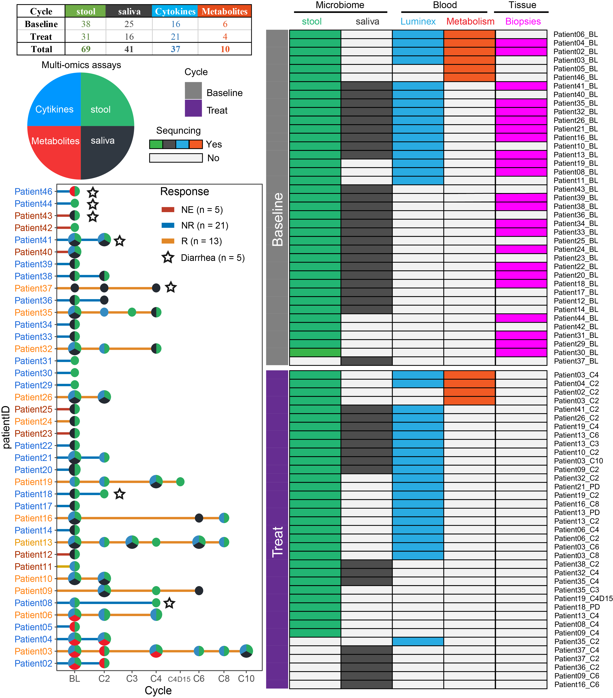

# Samples and Clinical

```{r setup, include=FALSE}
knitr::opts_chunk$set(echo = TRUE)
```

[`Return`](./)


## Introduction

<table><tr><td bgcolor=#AFEEEE>
<font size=4>This is introduction</font></td></tr></table>


<details>
<summary>
<font size=4>Requires</font>
</summary>
```{r tidy=TRUE,results='hold',message=FALSE}
library(tidyverse)
library(ggthemes)
library(ggsci)
library(ggpubr)
library(survminer)
library(survival)
library(survivalROC)
library(reshape2)
library(data.table)
library(ggExtra)
library(cowplot)
library(ComplexHeatmap)
library(scico)
library(colorspace)
library(RColorBrewer)
library(lubridate)
library(tableone)
library(kableExtra)
source("../R_function/colors.R")
source("../R_function/surv_plot.R")
theme_set(theme_cowplot())
"%ni%"<-Negate("%in%")
options(stringsAsFactors = F)
```
</details>

## Clinical
<a href="../Data/Data/clinical.csv" target="csv">Clinical.csv</a>

```{r}
cli<-fread("../Data/Data/clinical.csv",data.table = F)
factorvars <- colnames(cli)[-c(1:3,22:25)]
tableone_groups <- CreateTableOne(vars = colnames(cli)[-c(1:3,22:25)],
                                  strata = 'Response',
                                  data = cli, 
                                  factorVars = factorvars)
table1_groups <- print(x = tableone_groups, 
                       contDigits = 1,     
                       exact = factorvars, 
                       showAllLevels = FALSE, 
                       noSpaces = TRUE, 
                       printToggle = FALSE) 
table1_groups %>%
  knitr::kable(caption = "Recreating booktabs style table") 
```
## Samples sequending statistics

```{r fig.width=10/2.54, fig.height=10/2.54, dpi=600,fig.align='center'}
data<-fread("../Data/Data/samples_seqInfo.csv",data.table = F)

```        


